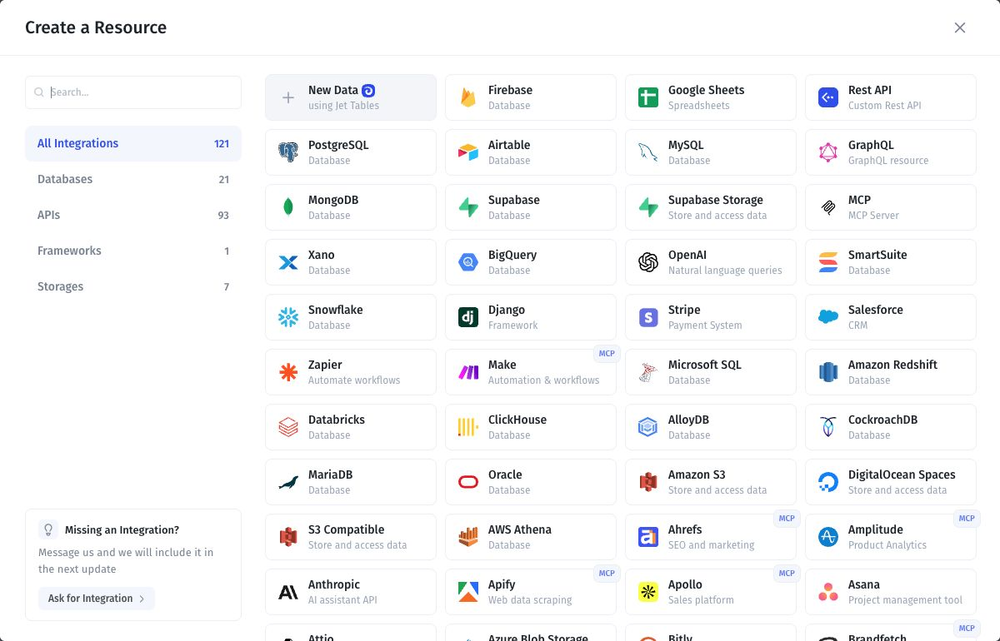
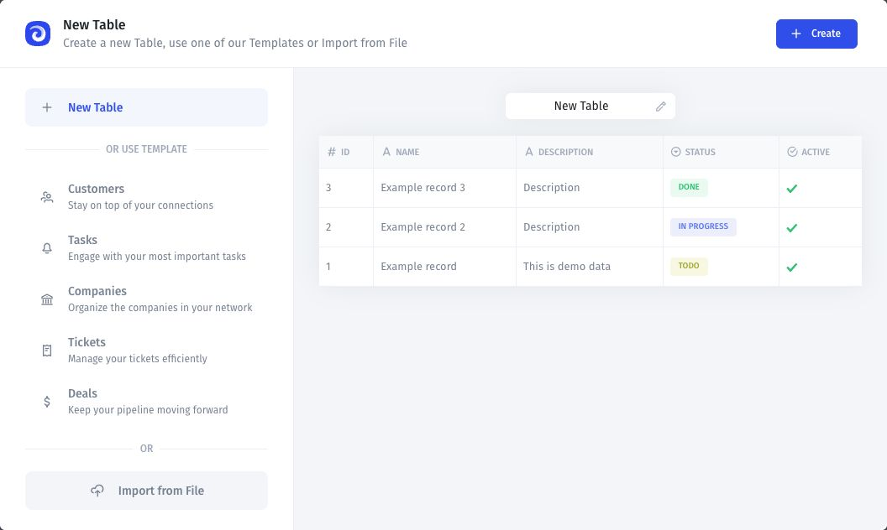
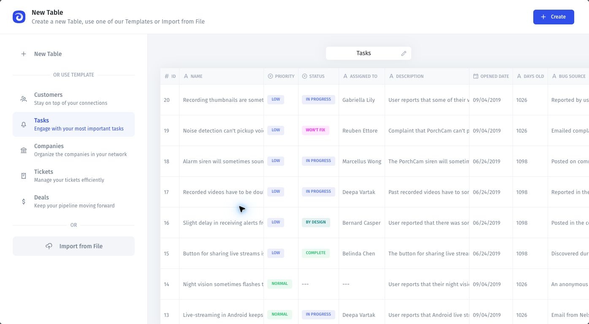

# Create a table

Create a table in Jet Databases, called **Jet Tables** in the resource picker.

## Before you start

Open an app where you can add a resource. If your data already exists in a file, use the import guide instead.

## Create the table

1. Open **Data** and select **Add Resource**.
2. Select **New Data — using Jet Tables**.

<figure><figcaption>
Select New Data using Jet Tables to create a resource.
</figcaption></figure>

3. Select **New Table**.
4. Use the pencil icon beside the table name to rename it.
5. Review the example fields and records, then select **Create**.

<figure><figcaption>
Review the table name, fields, and preview before creating the table.
</figcaption></figure>

## Start from a template

Select a template in the setup window to preview its fields and records. Rename it if needed and select **Create**.

<figure><figcaption>
Select a template to preview its starting fields and records.
</figcaption></figure>

## Verify the result

Select the table under **Collections**. Check its name, fields, and example records. Adapt or remove sample records before using it for your own data.

Continue with [Add and configure fields](../data/fields/add-and-configure-fields.md) and [Manage app data](../data/).
