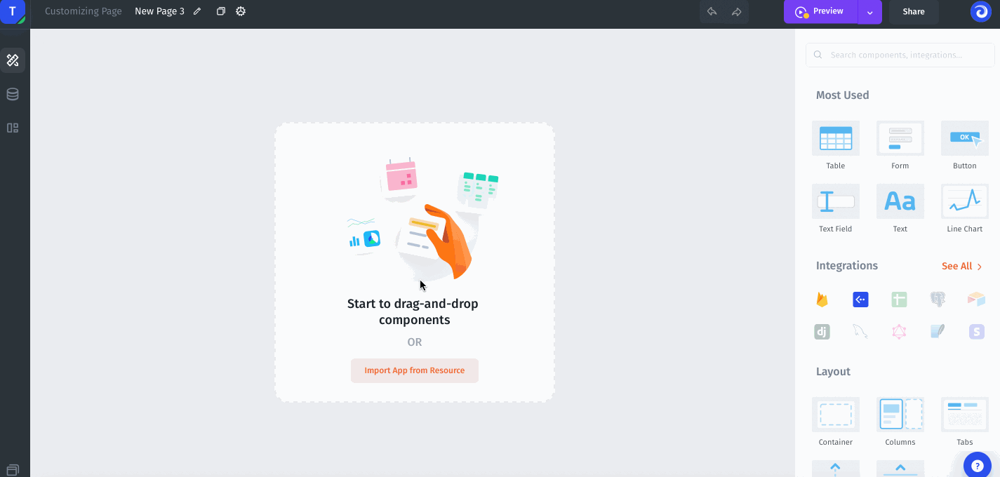
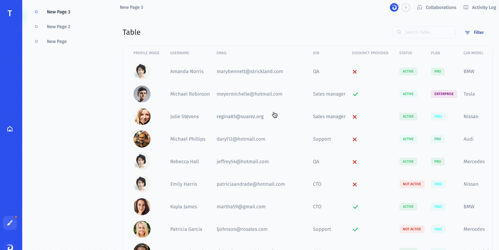
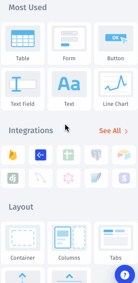

# Builder

To build your business app Jet provides a Visual Builder that helps you create Pages and customize, organize any components (table, button, charts, actions, etc).

Visual Builder is available after when you created a new project. Here is where you can find it:

### Library of Components

Visual Builder provides a library of different components: Containers, Basic, Data, Fields, Custom Components...

