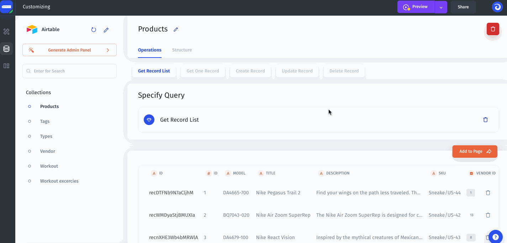

# Data

### Adding a new Resource

You can add an unlimited number of resources from the available resources by going to the Data section:

### Manage your Data (Add/Remove/Delete)

Once you have added your resource you can configure your data structure (e.g. set the desired field type) and perform some test CRUD operations:

