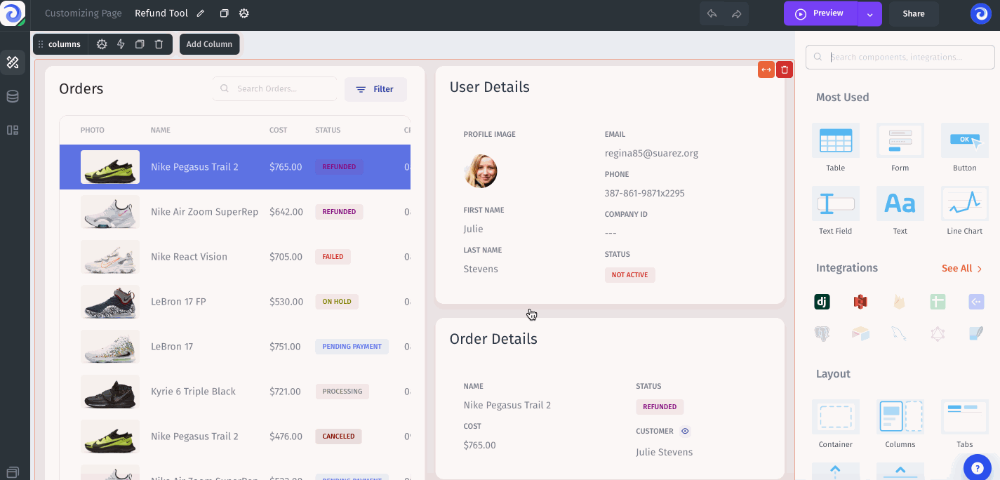
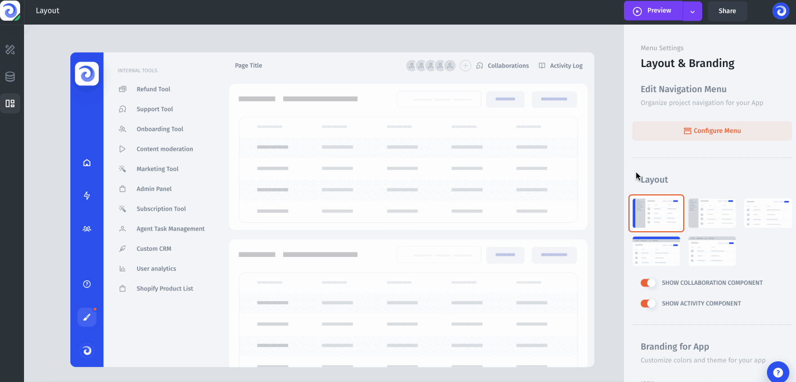

# Layout & Branding

The menu is a key part of your app's interface where you can navigate between pages. Here's the structure of a menu in Jet:

1. **Navigate between pages.** Here you can navigate between pages and sections.
2. **Home page.** Here you can navigate to the user activity log of the project to track changes (bottom) or quickly go to the home page (middle). As well as switch between your projects and environments.
3. **Profile & Visual Builder.** Here you can set up your Profile or go to the Visual Builder to start building your pages (bottom).

### Customizing the Menu

The menu customization allows you to customize the way different menu parts are displayed: group pages in sections, change pages' names, set new icons, and change the order of your pages. Menu customization is available in the **Layout & Branding** section:

Hit **Configure Menu** button to reorganize menu items, add new items, and create sections. You can also specify an icon for a page and change its name.

You can also set a new icon for your project, set the branding color, change the Layout for the application, and change the theme (Dark/Default).

