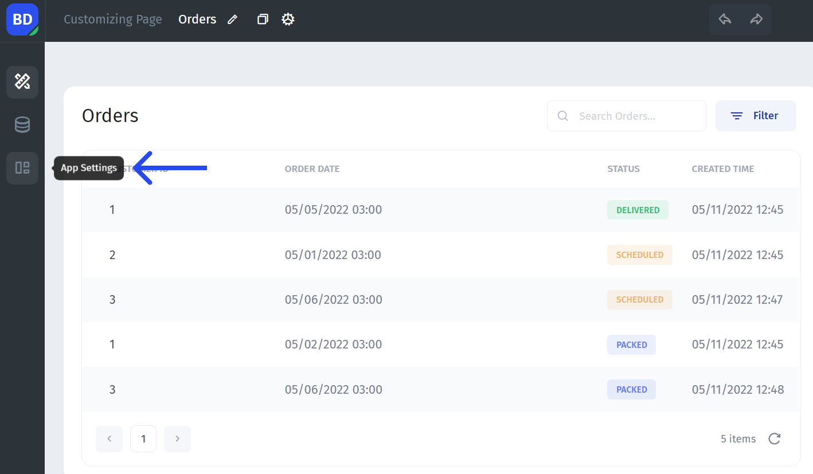
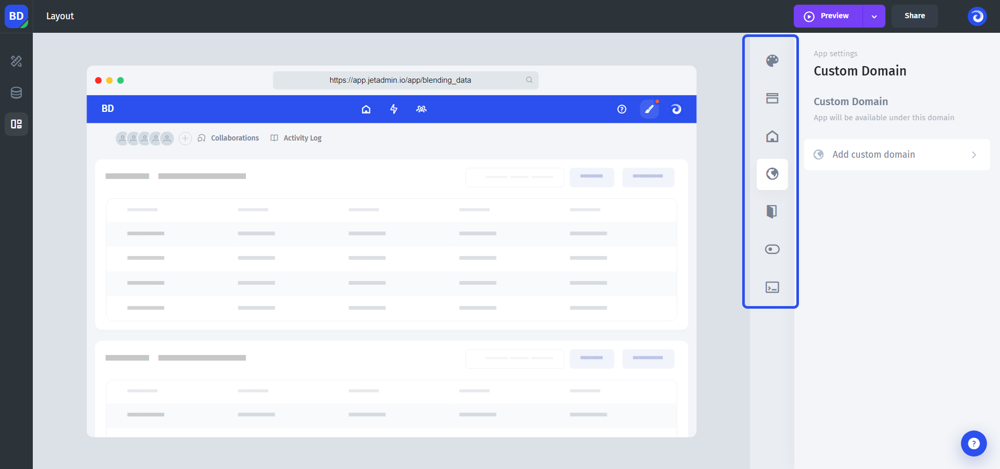
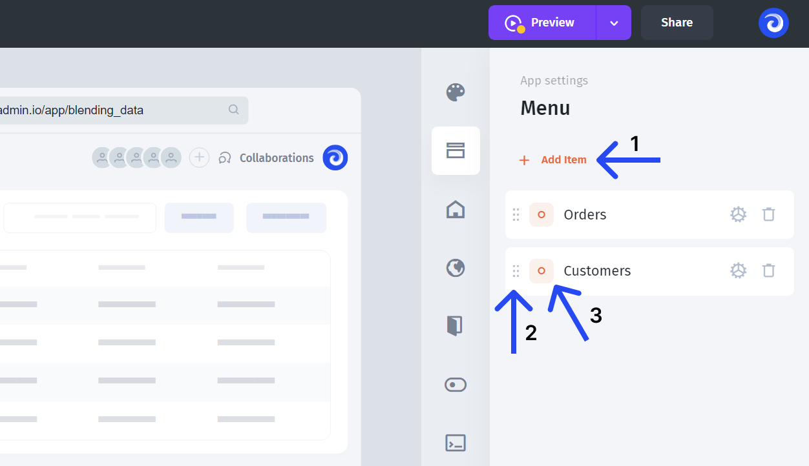
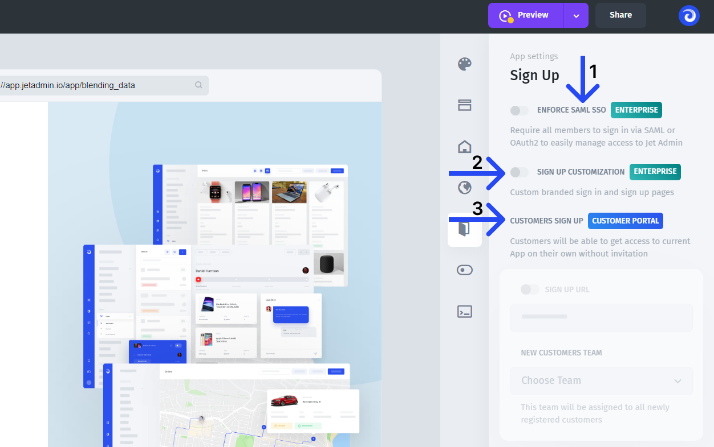

# App settings

**App settings** allow you to change the look-and-feel of the app and configure your app's parameters. You can find it in the left black bar in the builder mode.

**Hover your mouse** over the menu to open it up:

You'll see seven different tabs:

* **Appearance** - configure a color scheme and the layout of the app
* **Menu** - configure your app's menu, create sections and reorder the elements
* **App info** - set up the app's name and service URLs
* **Custom domain** - set up a custom domain for your app
* **Sign-up** - customize the sign-up page, add your logo, favicon, etc
* **Features** - additional features
* **Scripts & Styles** - add global JavaScript and CSS


Most of the settings changes take effect only in the User-mode, so to check the result, **preview or publish** your app (more on different modes [here](../preview-and-publish.md))


### **Menu**

While in the builder mode you have access to all the pages, the pages (and links) visible in the user-mode are configured in this tab. You can add a new menu item **(1)**, regroup pages by dragging and dropping them **(2),** and change the item's icon **(3)**.&#x20;

### Sign Up

If you need to create a sign-up/sign-in page for the users of your app, Jet Admin already has a built-in one that you can tune and customize to suit your case.

You can white-label the whole sign-up/sign-in page, replacing a **favicon**, Jet Admin **logo**, **brand images** on the right side, and **domain**.


At the moment, the out-of-the-box white-label functionality is in development, so you'll need to send the materials listed above manually in the support chat


There are several ways how you can further customize the sign-up/sign-in page:

* **(1)** You can set **your own authentication** system with your own auth provider (reach out to sales or support if you need that option)


Google SAML SSO is already set and available in all plans


* **(2)** If white-label is not enough, you can completely set up a fully **custom sign-up page**, using your own styles and colors.
* **(3)** If you're building a customer portal, you might want to set up the **invitation process** through a public link. New customers will sign-up through an auto-generated URL and automatically assigned a selected team.

### Scripts & Styles

**Scripts & Styles** allow you to set global JavaScript and CSS. **Global JavaScript** might come in handy for use-cases such as setting up a chat functionality in your app. **Global CSS** will allow you to customize the appearance of different UI components, but unlike page-specific CSS, the changes will apply to all the UI components of the same type. It might be helpful if you want to change the shape of all buttons in your app at once.
