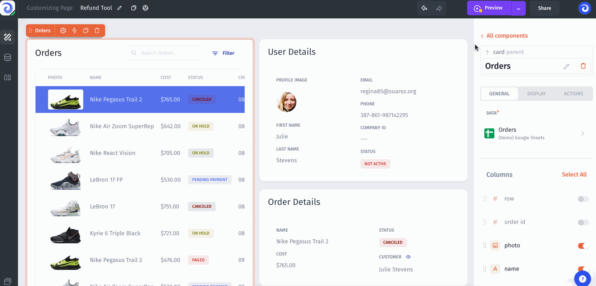

# Preview & Publish

### Preview

The preview allows you to see what your application will look like from the user's point of view. In this mode, you can switch between users to see what the application looks like from each user's point of view in case you are setting up visibility for components/pages depending on different conditions based on User & Teams Permissions/Properties.

### Publish

Once you have finished with the changes in the project within the editing session - you can publish the changes so that your users use the latest version of the interface in your application in the Production Environment.

