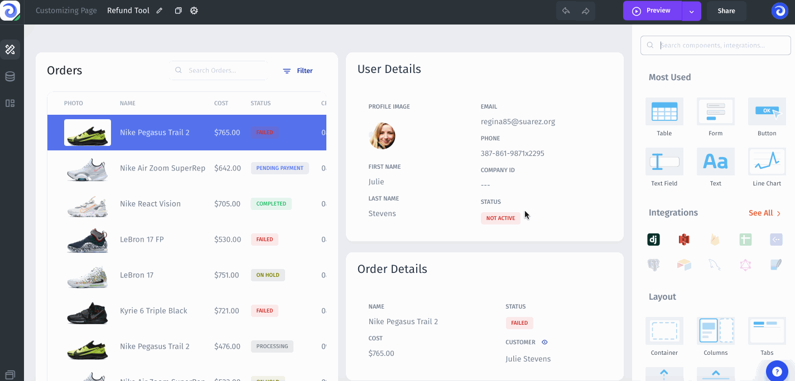

# Settings

In the project settings, you have access to sections with Users and Teams settings, including basic project settings such as project name, application type, and other credentials for API calls.

