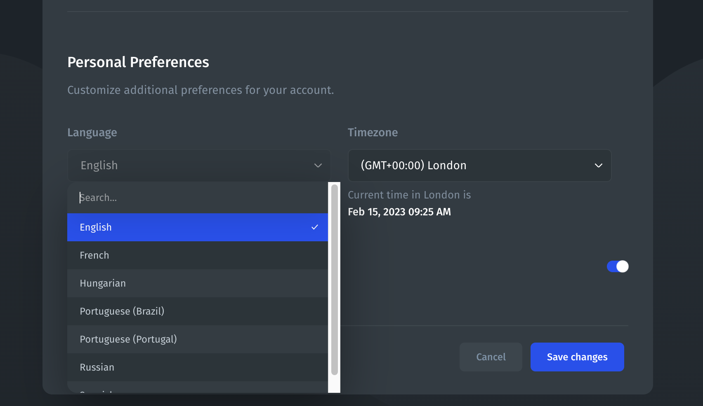
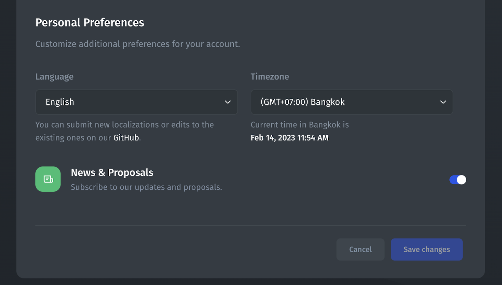
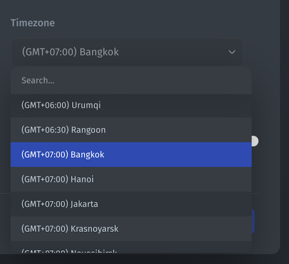

# Account Settings

The Localization feature allows you to specify the language and time zone for your account. The default language is English.


Changes will be applied only to the user mode - the part that the end-users of your app will be interacting with. The builder mode will remain in English.


### Setting up the language

#### Step 1: Go to Profile Settings

Inside the app builder, go to the top left corner and click on your account logo:

<figure><figcaption></figcaption></figure>

Then **scroll down** to the bottom of the page and find the Language dropdown menu. Choose your language from the dropdown:

<figure><figcaption></figcaption></figure>


If **your language is not on the list**, reach out to our support (bottom left corner in the app) to request adding your language. You can submit new localizations or edits to the existing ones on our [GitHub](https://github.com/jet-admin/jet-localization).


#### Step 2: Pick your language and save the changes

After this, when you view your app, it will appear in the language that you selected. However, the App Builder will remain in English.

**List of supported languages:**

* English
* Danish
* French
* Hungarian
* Italian
* Japanese
* Portugese (Brazil)
* Portugese (Portugal)
* Spanish

### Setting up the timezone

#### Step 1: Go to Profile Settings

Inside the app builder, go to the top left corner and click on your account logo:

<figure><figcaption></figcaption></figure>

Then **scroll down** to the bottom of the page and find the Timezone dropdown menu. Choose the preferred timezone for your app using the dropdown:

<figure><figcaption></figcaption></figure>

<figure><figcaption></figcaption></figure>

#### Step 2: Pick the timezone of your choice

Once you save the changes, your account will display date and time based on your chosen time zone.
