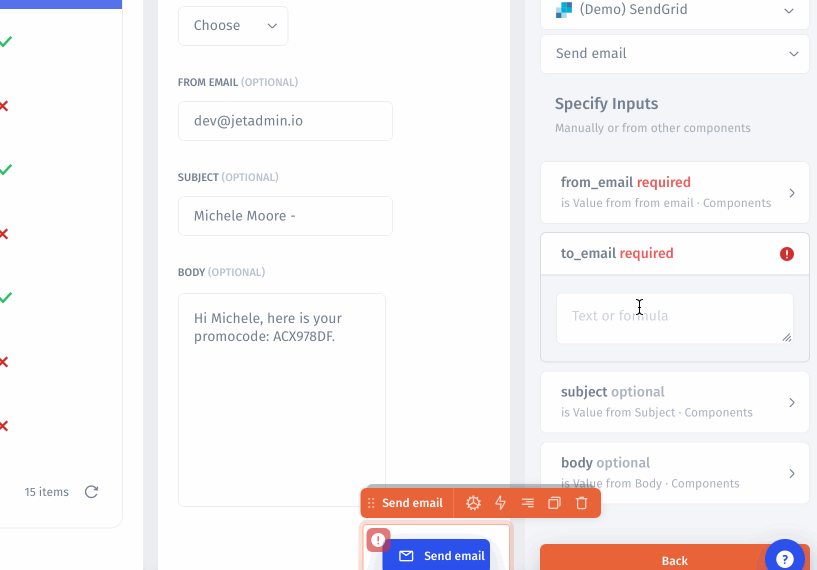

# Field Values

### Specify default values

You can set a default value for any parameter for the value to be passed automatically:

Now when the user sends an email, he or she will not have to manually enter the `from email` parameter.

### Extract values from components on the Page

Let's say you have the Customers table. Once the user is selected in the Customers table, his or her email value will be used as the`User email` parameter so that to send a promotional email with a Marketing tool. The succession of events will be this:

1. Click on Value text area. There will be a pop-up window.
2. Then select Customers table  -> Clicked row (the value will pass once you click a row) -> User email.
3. The Value field will be populated with the following expression:

`=elements.Customers["0"].selected_item.email`

### Ask the user to fill the form in your App

We need to configure Values for the "Send Email" button in that case. So all we have to do just select `Ask from user user option` in [Formulas](../formulas.md) pop-up window.&#x20;

.gif>)

Now, when the user will send an email, the values will automatically be passed from the selected row in the table to the button values.
