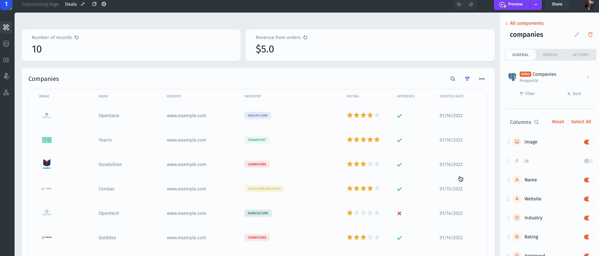

# Embed Apps

Jet allows you to embed apps using generated link or Embed HTML code (iFrame)

### Embed App using link

Finally, go to **Share** -> **Public Share** and copy the link.

<figure><figcaption></figcaption></figure>

### Embed App using iFrame/HTML

<figure><figcaption></figcaption></figure>
