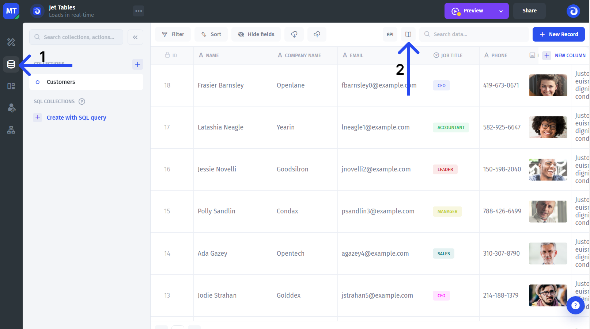

# Audit logs

You can **track** your users' and builders' activities with built-in audit logging.

To access audit logging, go to the Data Editor section and then click on the book icon at the top of the screen

<figure><figcaption></figcaption></figure>

Here you'll see all the logs with all the details for each event

<figure><figcaption></figcaption></figure>

<figure><figcaption></figcaption></figure>
