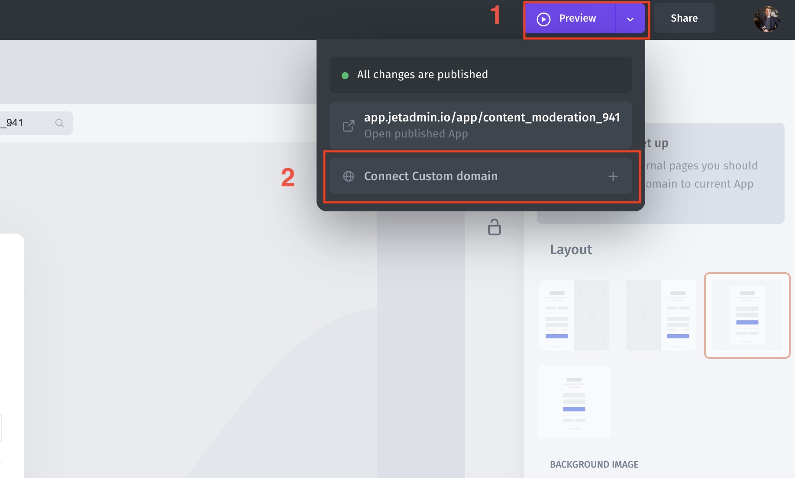

# Custom domain

To add a Custom Domain to your application, proceed to the Preview button on the top right and click on the **Connect Custom Domain**.

<figure><figcaption></figcaption></figure>

Type a domain that you would like to connect

<figure><figcaption></figcaption></figure>

### Add CNAME record

Add the following configuration record in your domain DNS settings:

* Type: **CNAME**
* Name (Host/Domain): **www**
* Destination (Target/Value): **app.jetadmin.io**

Click **Add Domain.** Typically, it takes from 5 mins to 24 hours to update your DNS.

<figure><figcaption></figcaption></figure>
