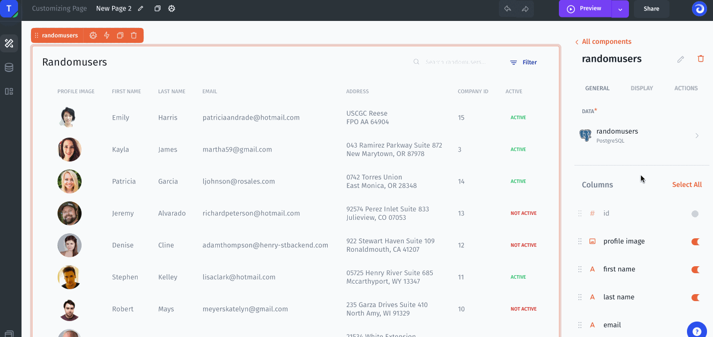
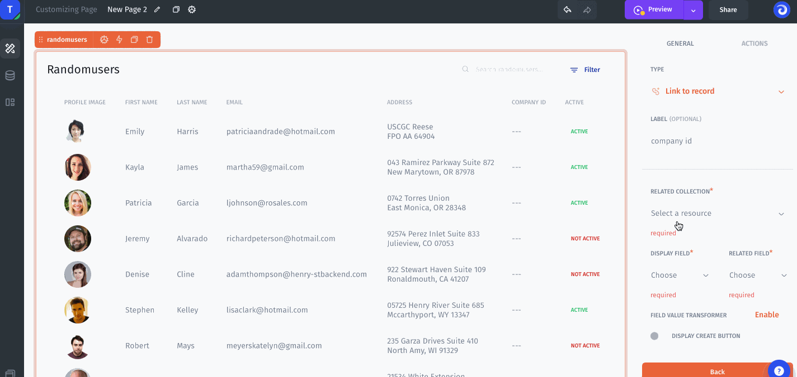

# 🔗 Link Between Tables

The related field allows you to represent the relationships between related records by creating links between them. This is particularly helpful when you have multiple tables of related items. For instance, if you have a table of customers and a table of companies, you can use a related field to link each contact to the company that they work for.

Here we'll show how to simply create a related Company field for each Customer. Each customer has `company_id`, to display and link the company in the Customer table let's specify `link to record`. There are 3 steps to set up a related field:&#x20;

1\. Specify type for a `company_id` column as `Link to record`&#x20;

2\. Specify `related collection` then select `related field` and select `Display field` to display it on the Customer table:


Related field and Display field are set automatically under the context but you can change these values.

