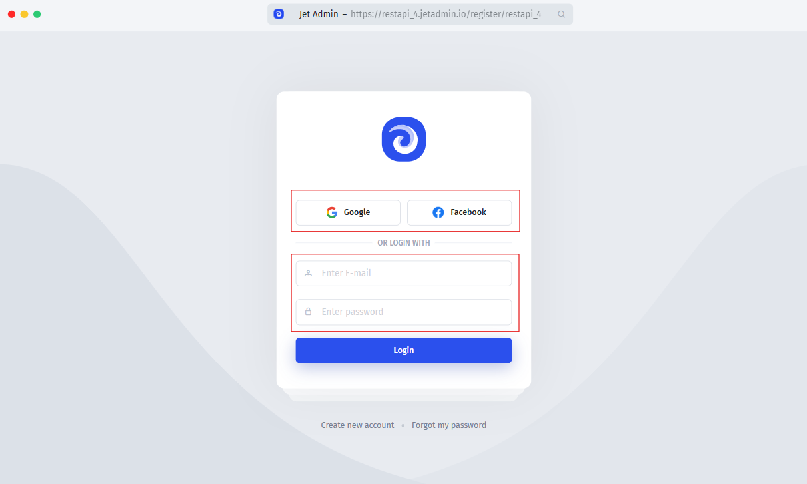
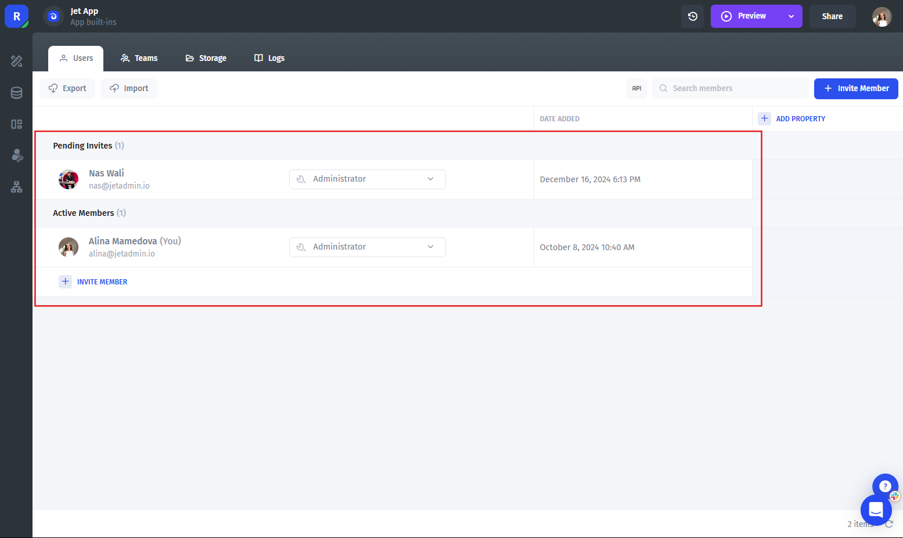

# 🔐 Users & Permissions

JetAdmin has a built-in **User Management System**. All invited users to your application ([invited by email](sharing-your-app.md#invite-by-email), [invited by link](sharing-your-app.md#invite-by-link)), will be available in the **Data** tab in the **"Built-ins"** section.

You'll also be able to set **granular permissions** and the properties to **separate data for the Portal** (multi-tenancy)

To find Users and Teams, follow the steps:

1. Go to the **Resources** section
2. Go to the `Users section` - here you can see users
3. Click on the `Teams Tab` - here you can see teams



### Access to the app

All the invited users, both internal and external, are automatically taken to the sign-in (or sign-up, depending on the settings) page. After signing up/logging in, the user will be redirected to either the dashboard where they can see the list of projects, or to the specific page.

The **default authorization** process involves authorizing in the following ways:

1. Google & Facebook authorization (basic SSO)
2. Authorization via credentials (login + password)

<figure><figcaption></figcaption></figure>

You can also implement **custom authorization** through SSO. See the topics in this section on implementing different SSO methods:

### User Management System

The built-in User Management System allows you to configure each user on a granular basis, as follows:&#x20;

1. **Specify user role**. Configure users' access to the application by setting a [specific role](create-and-manage-a-team.md).
2. **Specify user properties**. Set properties for users to control their [permissions](user-and-team-properties.md) and access to data.
3. **Sharing your app**. Invite your employees or customers to collaborate with your data. See [here](sharing-your-app.md) for more details.

<figure><figcaption></figcaption></figure>

### White Label & Customization

You can remove Jet's brand and replace it with **your branding** across the whole user journey in their Jet Admin app. You can also **customize the Sign-in/Sign-up page** to a great extent, choose the layout, put up your logo and favicon, configure a custom domain, or even completely rewrite the CSS.


[sign-in-sign-up](sign-in-sign-up/)



[create-and-manage-a-team.md](create-and-manage-a-team.md)



[user-and-team-properties.md](user-and-team-properties.md)

