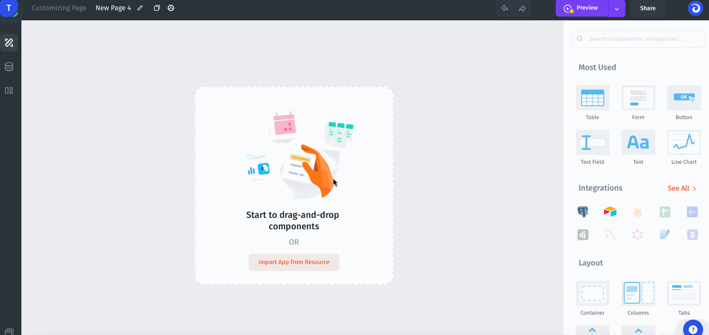

# Roles in Permissions

To limit access to data you can create different teams like Customer Support that has access to Tickets, or Sales Team has access to customers, orders, etc. You can create multiple teams with different Roles (**Administrator**, **Editor,** or **Read-only**).



### Create a new team

Navigate to the Teams tab to create a new Team.

### Team-based Permissions

Team Permissions are classified in two ways: **Project Permissions** and **Page Permissions**.

### Project Permissions

| Name                    | Description                                              |
| ----------------------- | -------------------------------------------------------- |
| Settings                | Permission to edit project settings                      |
| Billing                 | Permission to view billing information and make payments |
| Members and Teams       | Permission to share your app and create & manage teams   |
| Interface Customization | Permission to customize the app interface                |

### Page Permissions

You can provide access roles for each page: **Full Access**, **Read-only**, **Custom Access**, **No Access**:

.png>)

Allowing users to add, edit & delete records can be very powerful, but sometimes you want to restrict this to only certain Pages or to certain Teams/Users. With conditional add, edit & delete you can do this:


[conditional-add-edit-and-delete.md](../components-visibility/conditional-add-edit-and-delete.md)


