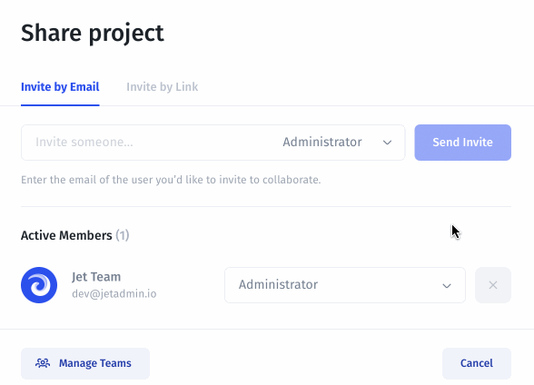
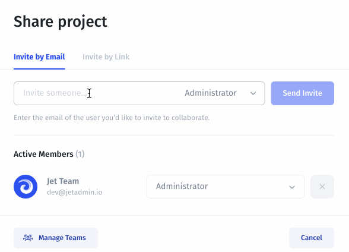
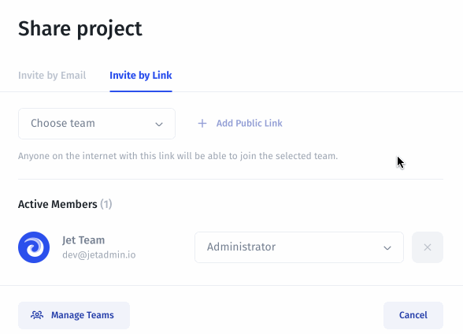

# Sharing your app

In JetAdmin you can choose how users will access your application: **Invite by email** or **Public Access via link**.

### Invite by Email

In this case people will not be able to access your app unless they are invited to your project by an administrator, and then logged in with an Invite link sent to their email.&#x20;

You can also choose the team that the user automatically joins as soon as he/she signs up and accepts the invitation.


Note that the Invite link is valid for 24 hours. You will see all the users in your app in the Users tab.


As soon as the user follows the link in the email, he/she will see the following screen to accept the invitation to join the app:

.png>)

### Invite by Link

Invite by Link means that if anyone has the link to your app they can view it once they Sign Up.

You can also choose the team that the user automatically joins as soon as he/she signs up and accepts the invitation. All users signed up through that link will automatically get into your application and exactly the team you picked.

As soon as the user follows the link, he/she will see the following screen to accept the invitation to join the app:

.png>)


You will see all the users in your app in the Users tab.

