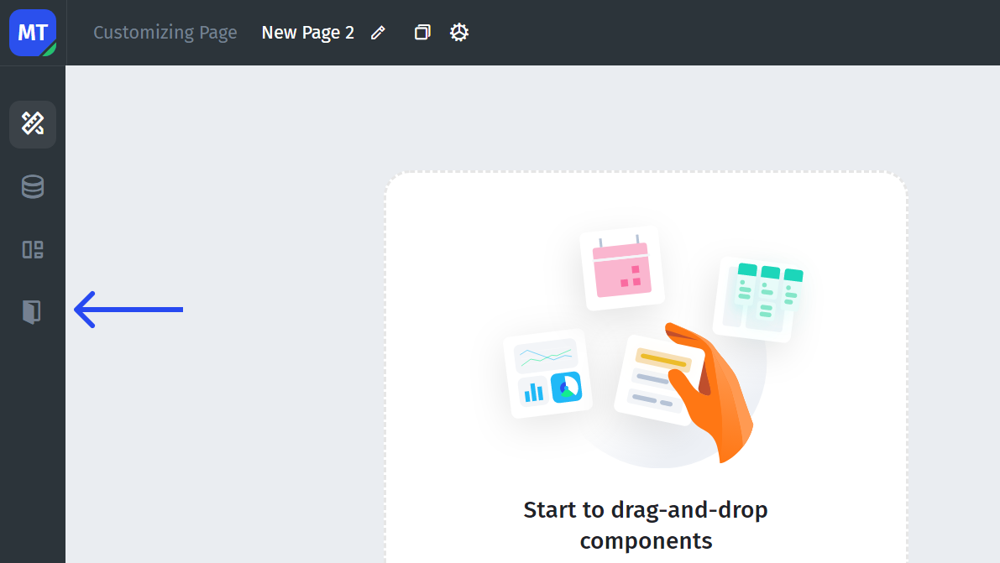

# Sign In/Sign Up

You don't need to build the Sign-in/Sign-up page in the UI as Jet already has a **separate Sign-in/Sign-up page builder**.

To access it, click on the door icon inside the builder:

### Sign-in/Sign-up page

All invited users, both internal and external, are automatically taken to the sign-in (or sign-up, depending on the settings) page. After signing up/logging in, the user will be redirected to either the dashboard where they can see the list of projects or to the specific page.

The default authorization process involves authorizing in the following ways:

1. Google & Facebook authorization (basic SSO)
2. Authorization via credentials (login + password)

.png>)

You can also implement your own authorization through SSO. See the topics in this section on implementing different SSO methods:

### User Management System

The built-in User Management System allows you to configure each user on a granular basis, as follows:&#x20;

1. **Specify user role**. Configure user's access to the application by setting a [specific role](../create-and-manage-a-team.md).
2. **Specify user properties**. Set properties for users to control their [permissions](../user-and-team-properties.md) and access to data.
3. **Sharing your app**. Invite your employees or customers to collaborate with your data. See [here](../sharing-your-app.md) for more details.

.png>)
