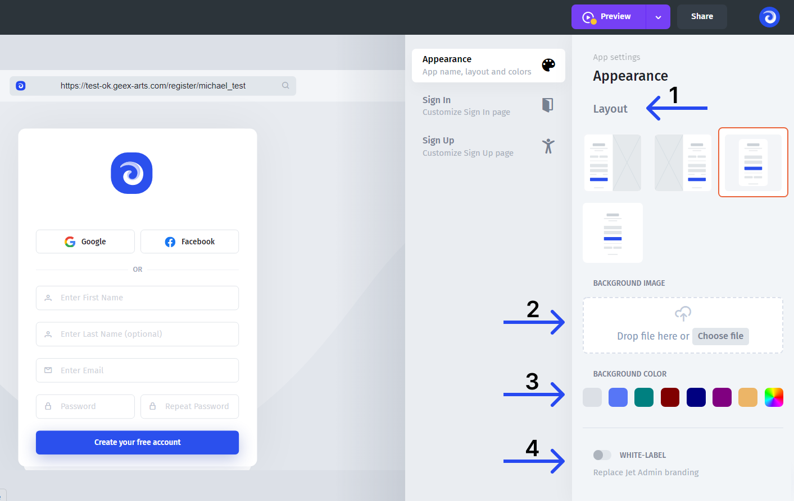

# Sign In/Sign Up

You don't need to build the Sign-in/Sign-up page in the UI, as Jet already has a **separate Sign-in/Sign-up page builder**.

To access it,&#x20;

1. Click on the Sign-in & Sign-up icon inside the builder



### Sign-in/Sign-up page

Sign-in/Sign-up page has three major sections:

* **(1)** **Menu** - configure the appearance, sign-in, and sign-up separately
* **(2) The preview** - check in real-time changes taking effect
* **(3)** **Setting** - this is where the configuring happens&#x20;


To be able to customize the Sign-in/Sign-up, you need to **set up a custom domain first**. See the image below.


Learn how to set up a custom domain in the following article:


[configuring-a-custom-domain.md](../../project-settings/configuring-a-custom-domain.md)


#### Appearance

The appearance tab allows you to:

* **(1)** Switch between the **layouts**
* **(2)** Set the **background picture**
* **(3)** Set the **color theme**
* **(4)** Enable the **White label**

#### Sign-in & Sign-up

The sign-in and sign-up tabs allow you to configure the settings, specific to the sign-in and sign-up, such as Terms of service URL, titles, and customer sign-up flow for the Portal.
