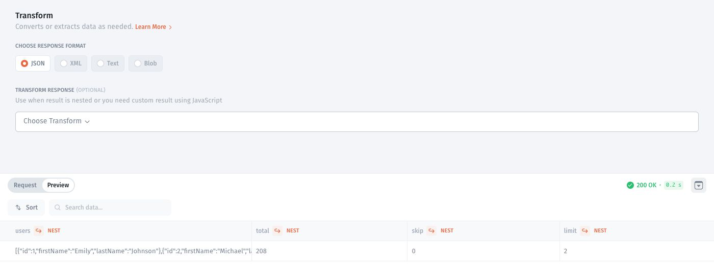
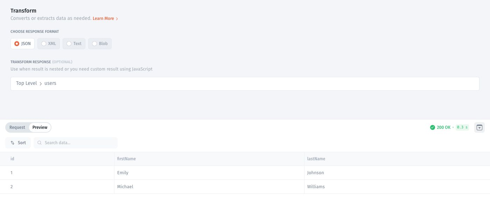
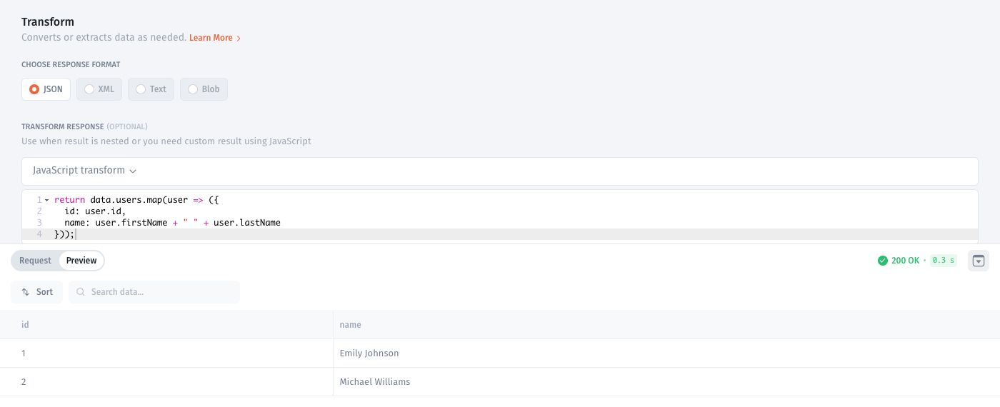

# Transform API responses

Transform a response when its structure does not match the fields your component needs. Test the original request first, then compare the transformed output.

## Example response

This guide uses the public [DummyJSON Users API](https://dummyjson.com/docs/users). With the base URL `https://dummyjson.com`, send a GET request to `/users?limit=2&select=id,firstName,lastName`.

The response contains a `users` array alongside pagination metadata. The records used below are:

```json
{
  "users": [
    {"id": 1, "firstName": "Emily", "lastName": "Johnson"},
    {"id": 2, "firstName": "Michael", "lastName": "Williams"}
  ]
}
```

<figure><figcaption><p>Before extracting records, the users array appears inside the response object.</p></figcaption></figure>

## Select the response root

1. Open **Transform**.
2. In the preview, open **NEST** on the **users** column and choose **Nested data as result**.
3. Check that the response root shows **Top Level → users** and that the preview contains two rows.

<figure><figcaption><p>Selecting users exposes id, firstName, and lastName as columns.</p></figcaption></figure>



## Transform fields with JavaScript

As an alternative to selecting the nested array, use a JavaScript transform on the original response object. The variable `data` contains the response.

1. Open **Transform → JavaScript transform**.
2. Enter this code:

```javascript
return data.users.map(user => ({
  id: user.id,
  name: user.firstName + " " + user.lastName
}));
```

3. Run **Test Request** and inspect the output:

```json
[
  {"id": 1, "name": "Emily Johnson"},
  {"id": 2, "name": "Michael Williams"}
]
```

<figure><figcaption><p>The transform combines firstName and lastName into name while preserving each ID.</p></figcaption></figure>

4. Test an empty list: `{"users":[]}` should return `[]`.
5. Save after the preview matches the fields your component needs.

This code expects the original object with a `users` array. If you already selected that array as the root, inspect the value passed to the transformation and adjust the code accordingly.

The existing walkthrough below demonstrates another field-mapping example.



If the API returns an error or a different shape, resolve that before mapping fields. See [Handle API errors](error-handling.md).
