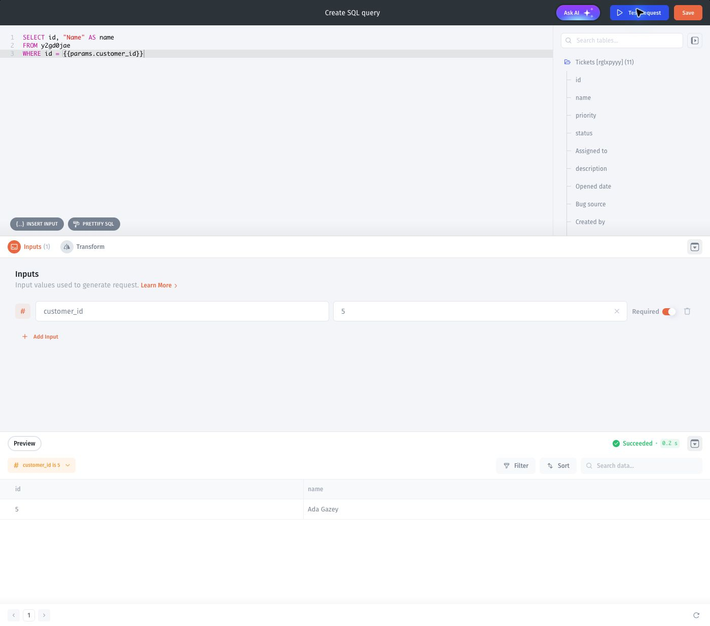

# Use dynamic SQL inputs

Reuse a query with different values by defining inputs rather than editing the SQL each time.

## Before you start

Connect a SQL resource and open the SQL Query Builder. This example assumes an `Orders` table containing `id`, `customer_id`, and `total`. Use the table and column identifiers shown in your resource.

## Define and use an input

1. Add a numeric input named `customer_id` in the query's inputs.
2. Enter a test value, such as `1`.
3. Insert the input into the query:

```sql
SELECT id, customer_id, total
FROM Orders
WHERE customer_id = {{params.customer_id}};
```

4. Run the query using the test control and inspect the returned rows.
5. Change the test input to `2` and run it again.
6. Save the query after verifying both results.

## Jet Tables example

This separate template-data example defines a required numeric **customer\_id** input. The standalone customer lookup uses the actual table identifier shown by Jet Tables and returns customer 5, **Ada Gazey**.

<figure><figcaption><p>Use the table identifiers in your own resource; the template customer in this example has ID 5.</p></figcaption></figure>

## Verify

Every returned row should have the requested customer ID. An empty result can be valid if that customer has no orders.

<figure><figcaption><p>The related Tickets–Customers join succeeds but returns no rows for customer_id 99999. Check the input and matching data before treating an empty result as an error.</p></figcaption></figure>

This empty-result screenshot uses the [ticket/customer join example](../synced-tables/join-data-from-multiple-sources.md), rather than the standalone lookup above.

Bind the saved input to an appropriate app value when using the query in a component. A filter is not a substitute for permissions.

For editor controls, see [SQL Query Builder](sql-query-builder.md). For existing queries using older input syntax, see [Write and test a SQL query](make-a-sql-query.md).
