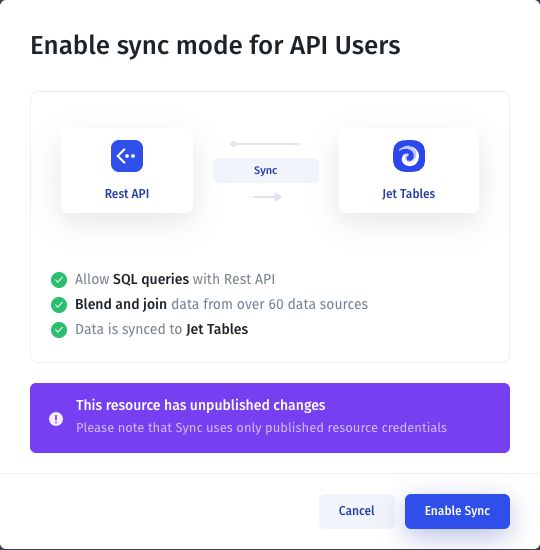

# Create a sync connection

Use a sync connection to copy records from a supported source into Jet Databases and keep them refreshed.

## Before you start

Have access to the source and its connection credentials. Follow its [Data Sources guide](../data-sources/) to select the account, tables, or collections you need. Sync is available only for supported integrations.

## Connect and verify

1. Add the source and complete its authentication steps.
2. When offered a connection type, select **Sync connection**.
3. Complete the source's setup and open the resource in **Data**.
4. Check the sync status and last sync time.
5. Compare a few records, including their IDs and field values, with the original source.

If **Sync connection** is not offered, use the connector's available connection mode or contact support about sync availability.

## REST API sync setup

For an API collection that offers **Sync to Jet Tables**, review the confirmation dialog. If it reports unpublished resource changes, publish the intended resource configuration before enabling sync: the dialog states that sync uses published resource credentials.

<figure><figcaption>
This setup view shows the publishing prerequisite; it does not show a completed sync.
</figcaption></figure>

## Next steps

* Added or changed a source table or field? Follow [Sync schema changes](syncing-schema-and-data.md).
* Changed record values? Follow [Refresh data and manage sync](refresh-data-and-manage-sync.md).
* Need data from two sources in one result? Follow [Join data from multiple sources](join-data-from-multiple-sources.md).
* Missing records or errors? Follow [Troubleshoot syncing](troubleshoot-syncing.md).
