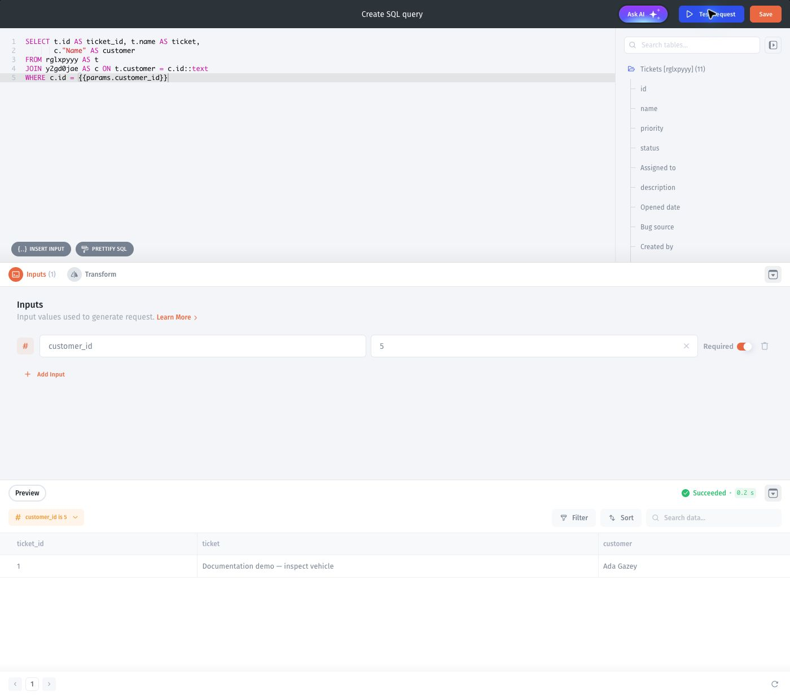
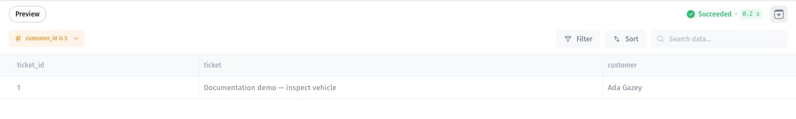

# Join data from multiple sources

To demonstrate how the data blending works, we'll use two data sources: Airtable and Google Sheets, where the former contains the `Order` table and the latter - the `Customers` table. Notice that the `Customer ID` column in the `Orders` table refers to the `ID` in the `Customers` table.

Once you've connected your data sources (read more on particular integrations [**here**](../data-sources/)), proceed to the data section and pick a data source where you want to perform the blending _(you can choose either one, it's just a matter of convenience)_

1. Create a new **Virtual Collection**
2. Name the Collection
3. Click on the `Create` button
4. You'll see all the data sources you've connected using "Sync" on the right. You can now pick the columns and use them in your query:



And after writing and running our query, we get the resulting table, containing `Full name` and `Country` columns from the `Customers` table together with the `Order Date` column from the `Orders` table.

After saving changes, we get a collection with joined data that we can later use in the interface.

## Verify the join

Use a stable customer ID as the matching key. Two orders with the same customer ID should show the same customer. Check a missing customer ID and decide whether your query should keep or exclude that order.

For a small test, use Customers 1 (Ada) and 2 (Grace), with Orders 101 and 102 linked to customer 1 and Order 103 linked to customer 2. A join should return three order rows. Unexpected extra rows can mean the customer key is not unique.

A Virtual Collection supports SELECT queries and is read-only. It does not write the joined result back to either source.

## Related example: a join within one Jet Tables resource

The following SQL collection joins Tickets and Customers from the **same** Jet Tables resource. It illustrates matching IDs and testing a parameterized join; it is not a cross-source Virtual Collection example.

<figure><figcaption>
Join the two demo tables and filter by the numeric customer_id input. The text cast matches this demo link field's stored type.
</figcaption></figure>

<figure><figcaption>
With customer_id set to 5, the query returns ticket 1 and its linked customer, Ada Gazey.
</figcaption></figure>
