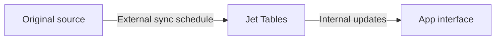

# Refresh data and manage sync

Use these controls when existing record values have changed. For new tables or columns, use [Sync schema changes](syncing-schema-and-data.md).

## Understand the two refresh stages

External updates bring changes from the source into Jet Tables. Internal updates propagate Jet Tables changes to the interface. A current interface does not mean the source was just refreshed.

## Refresh records

1. Open the resource in **Data**.
2. Check whether syncing is **active** or **paused**, and note the last sync time.
3. Use **Sync now** to request a manual refresh.
4. Review the resulting status and last sync time.
5. Reopen a known record and compare its value with the source.

<figure><figcaption>
Sync status, pause control, and Sync now on the data source page
</figcaption></figure>

<figure><figcaption>
Last sync date and time beside the resource status
</figcaption></figure>

## Check options and events

Open the three-dot menu and select **Sync options** to inspect the connection settings. To change the external sync interval, contact Jet Admin support.



For diagnostics, open **More → View Sync Events** and inspect the relevant event details.



If records still differ, follow [Troubleshoot syncing](troubleshoot-syncing.md).
