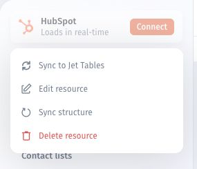

# Sync schema changes

Refresh a resource's schema after adding or changing tables or fields in the source. A schema refresh updates the structure Jet Admin discovers; refreshing record values is a separate task.

## Before you start

Make the schema change in your source first. Use an administrator account in Jet Admin, and check that the resource's credentials can access the affected tables and fields.

## Refresh the schema

1. Open **Data** and select the resource you changed.
2. Open the resource's **More** menu and select **Sync Structure**. Some resource interfaces label the schema-refresh control **Sync**.

<figure><figcaption>
Select Sync Structure from the resource menu. This image shows the command, not a completed refresh.
</figcaption></figure>

3. After the refresh, open the affected table or collection.
4. Check that the new table or field appears.

<figure><figcaption></figcaption></figure>

### REST API resources

Open the REST API resource and use its schema-sync control after changing the structure exposed by the API.

<figure><figcaption></figcaption></figure>

## If a table or field is still missing

Check that the change exists in the source and that the credentials used by Jet Admin can access it. Confirm that you refreshed the intended resource.

For further checks, see [A data resource is failing to sync](../../faq-and-troubleshooting/a-data-resource-is-failing-to-sync.md).

## Refresh record values

If the table structure is correct but record values are stale, use **Sync now** for a synced connection. See [Sync Options](refresh-data-and-manage-sync.md) for sync status, manual refresh, events, and interval settings.
