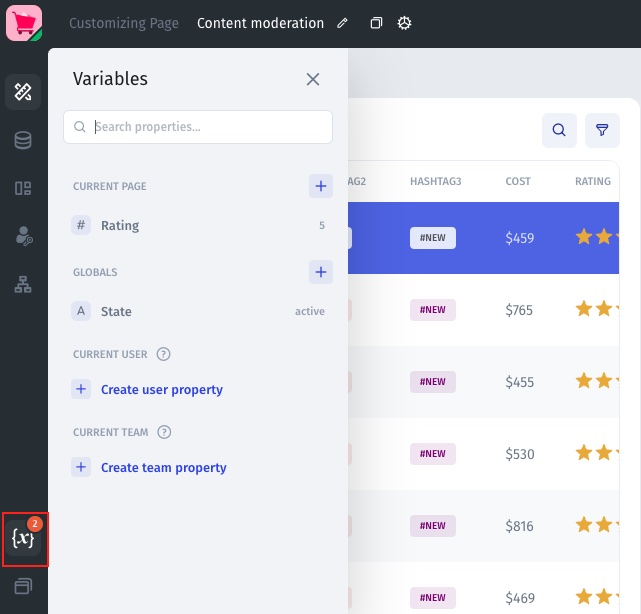

# 🔠 Variables

In Jet, users can create two types of variables using State Variables: Temporary (for the user session, resets on refresh) and Local Storage (stored in the browser across sessions). Temporary variables are session-based and are reset when the user refreshes the page, while Local Storage variables are stored in the browser and persist across sessions. Local Storage variables utilize the browser's Storage interface to read and write client-side data.

Builders can use these variables to store local states in their applications, allowing for caching and reusing intermediate states across different APIs and components.

To access the context menu for State Variables, users can find it in the Variables menu, which can be accessed by hovering over the Variables icon on the left-hand side of the App Builder.

<figure><figcaption></figcaption></figure>

<figure><figcaption></figcaption></figure>

### **Create a variable**

<figure><figcaption></figcaption></figure>

* Global/page variable: Choose whether you want to create a variable that is accessible from _only_ this page or whether you want to create a global variable that can be accessed from anywhere in your app.
* type (text, boolean, date, etc.): Choose the variable type
  * You can also choose a display format, for example if you want to display currency symbol if your variable is for money, or if you want to display a percent sign if your variable is a percent.
* default value:  (Optional) set a default value for your variable.
* save to local storage / temporary; `Temporary State Variable, Local Storage State Variable`\
  Depending on how you plan to use your variable, you can choose whether to make your variable temporary – only available for the current user session – or stored – available to be used across browser sessions.

### **Deleting, editing, or making variable stored/temporary**

If you click on the button with the three dots next to the variable you want to change, a dropdown menu will appear that allows you to delete, edit, or change the variable from temporary to stored and vice versa.

<figure><figcaption></figcaption></figure>

### **Reference a variable**

You can easily reference a variable by finding or searching for it it in the _ƒx formula_ menu.

<figure><figcaption></figcaption></figure>
