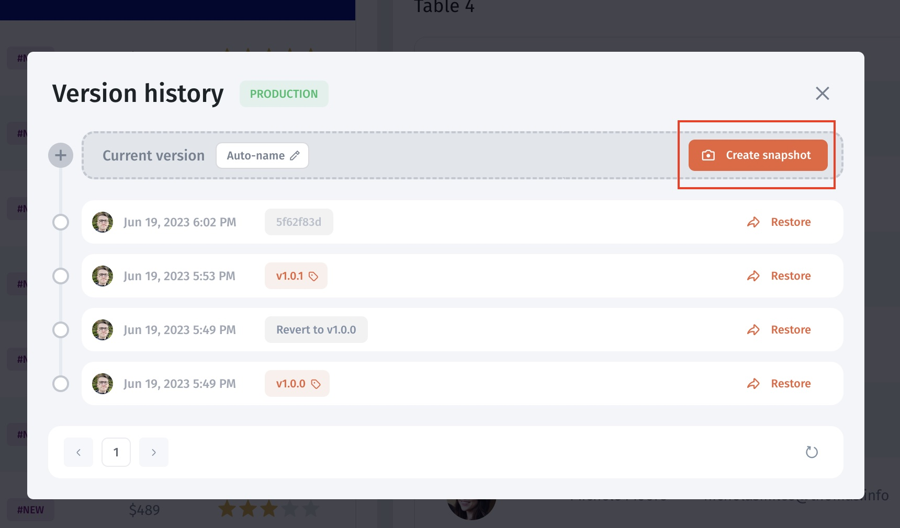

# 🎚️ Version Control

By default, any changes made to a Jet app are automatically saved to the current working version and are immediately visible to all users. Enable app versioning or reverting back to a previous state.

Releases enable users to implement app versioning and release changes using a unique version number representing the app's specific state. When a release is published, it becomes the live version for users to interact with, providing a secure way to test and deploy changes without causing any disruptions.&#x20;

Jet keeps a detailed record of all modifications made, allowing users to browse the list of versions and revert the app to a previous state if necessary.

<figure><figcaption></figcaption></figure>

### Releases


Releases are only available on paid [Jet plans.](https://www.jetadmin.io/pricing/internal-tool)


The current state of Jet apps can be version-controlled and made available to users. Whenever a release is published, it becomes the active version for all users. The published release can be modified at any moment and revert the present working version back to alterations made in a previous version.

1. Click on Version History on the right-top bar

<figure><figcaption></figcaption></figure>

2. Check the list of releases/snapshots. You can do the following actions:

* Create a new release
* Revert changes
* Set up a release name

<figure><figcaption></figcaption></figure>

### Create a new release

Click **Create snapshot** to create a version for release. You can also specify a release name or auto-generate it.&#x20;

<figure><figcaption></figcaption></figure>

### Revert changes

You have the ability to revert the current working version to a previous state. Simply choose a historical point and hit the **Restore** button. While this action will undo all modifications made post the chosen point, it does not erase them from the historical record.

<figure><figcaption></figcaption></figure>

Every time you perform a reversion, this action is also recorded in the history under the label **Reverted changes**. If necessary, you can revert back to a prior historical point to undo the reversion, thereby restoring the changes to the current working version.

### Creating a backup version


At the moment, Jet doesn't have an automated backup system so you should save and store relevant versions manually


To save a stable version, open your app in the builder mode and click on the "App" icon in the top left corner

<figure><figcaption></figcaption></figure>

Then choose the environment you want to save the version from (click the gear icon to drill down)

<figure><figcaption></figcaption></figure>

After that, you can **download the current configuration** and store it in your local storage

<figure><figcaption></figcaption></figure>

### Restoring a previous version

To rollback to the previously saved version, you'll need to click upload and select the backup file that's been saved. After that, the changes will be pushed automatically

<figure><figcaption></figcaption></figure>
