# ⚙️ Automations

**Automations** allow you to create a sequence (or workflow) of events that is executed based on a  specific trigger. Workflows consist of triggers and steps.

Here's an **example** of a workflow that is triggered when a button is clicked and then it either creates a record in Airtable or shows a notification based on whether the "Yes/No" condition is met.

## Overview

The workflow builder consists of several **key parts**:

**(1) Triggers** determine when (on what condition) the workflow will run. For example, this might be a button click or a row click in a table.&#x20;

**(2) Steps** consist of **actions**, which run in a sequential manner when a workflow is triggered, and **rules**, which allow you to branch the sequence based on certain conditions. An example of an action would be "Updating a record in Airtable" and an example of a rule could be "If condition" that will divide a workflow into two branches.&#x20;

**(3)** You can add **new steps** before or after any step, just click the "+" icon

**(4)** **Workflow result** closes the sequence and can be used to configure the workflow outputs

**(5)** The **configuration tab** that opens up when you select a trigger or a step

## When to use it

For the most part, you'll need a single action, such as `changing a status` or `making a refund`. However, in specific cases, you'll need a whole sequence of actions to be executed, often involving conditional logic.

**Typical tasks** for workflows might include:

* Changing a user's status and sending a notification via Sendgrid
* Showing an error notification and sending a notification with details in Slack
* Going back to a specific page after editing the customer details

## Triggers

To start building automation, **select the trigger** which will initiate it. Triggers can be broadly divided into three categories:&#x20;

* **Buttons**
* **List actions**
* **Success/Error actions**

### Buttons

The most common one is `button`. To create an automation, click on the "Click action" **(1)** and then choose "Run Workflow" **(2)**.

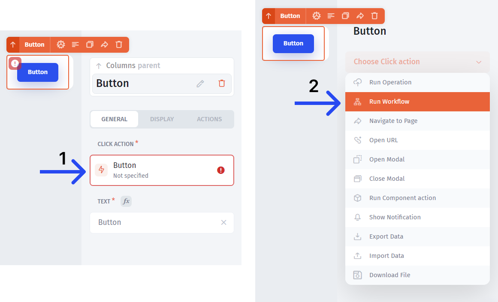

### List Actions

You can also create automation for any of the **list actions**. The lists include `Table`, `Map`, `Kanban`, `Gallery`, `Timeline`, and `Calendar`.

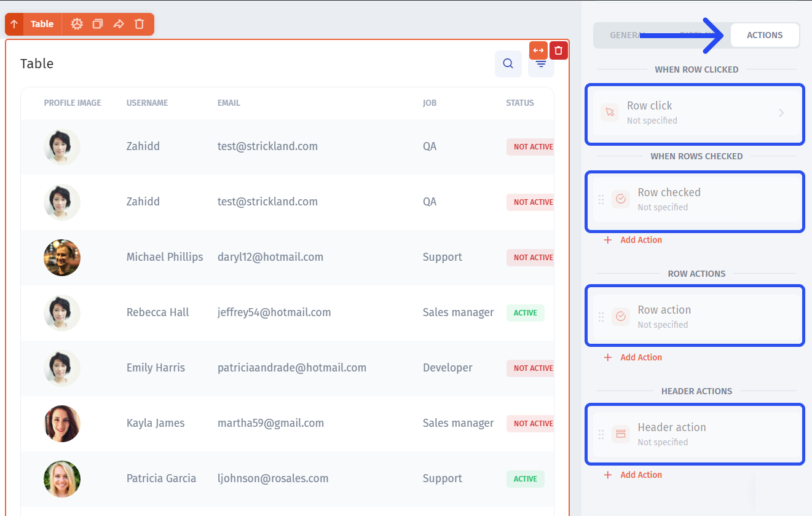

### Success/Error actions

Another type of an action that can trigger workflows is `Success/Error`:

.png>)

In all the cases, you'll need to **choose the "Run workflow"** type of action **(1)** and click on the workflow section **(2)**:

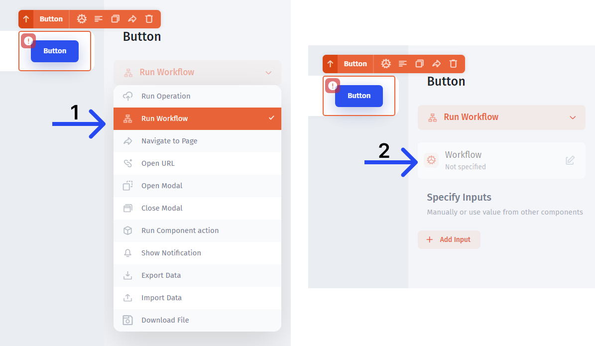

## Actions

To add an action step (or a rule step), just click on the "+" icon:

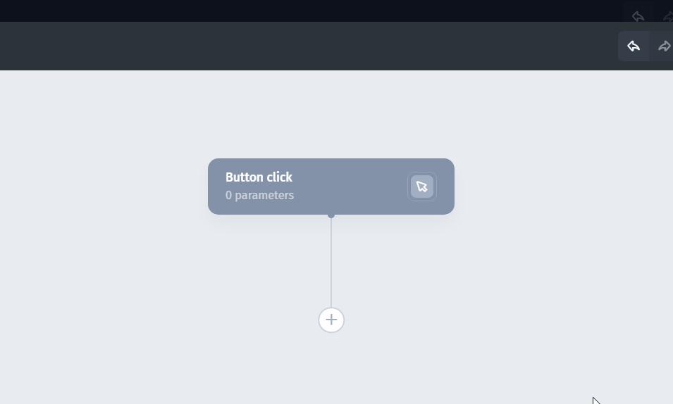

Then you can choose from the **list of operations** (actions) for the step. There are two major categories of actions:

* **(1) Data actions** - allow you to interact with the data, that's connected to Jet
* **(2) Other actions** - service operations like navigating to a page or showing a notification


**App built-ins** allow you to create actions for users and teams (groups of users)


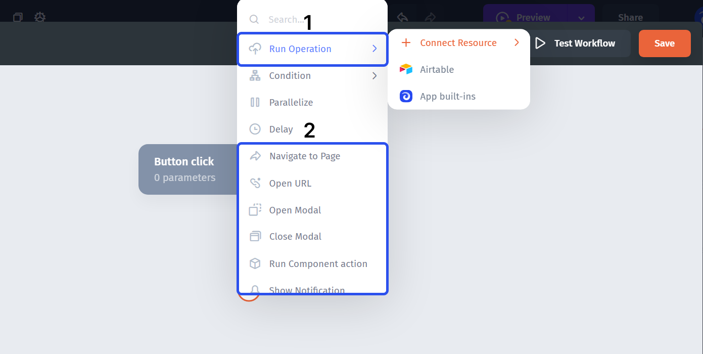

For the **Data actions**, once the step is added, you can configure the resource **(1)**, the collection (table) **(2)**, and the action **(3)**:

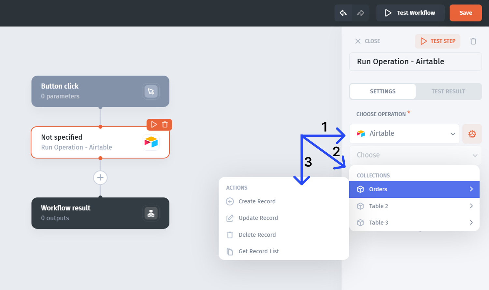

## Rules

Rule steps allow you to run alternative or simultaneous sequences based on specific conditions.

There are three types of rule steps:

* **Conditions** - allows you to set up a conditional logic that will create and (later) run different workflow branches based on whether a condition (or conditions for the "Switch") is met
* **Parallelize** - allows running multiple branches in parallel, simultaneously
* **Delay** - can specify the delay (in seconds) between the steps

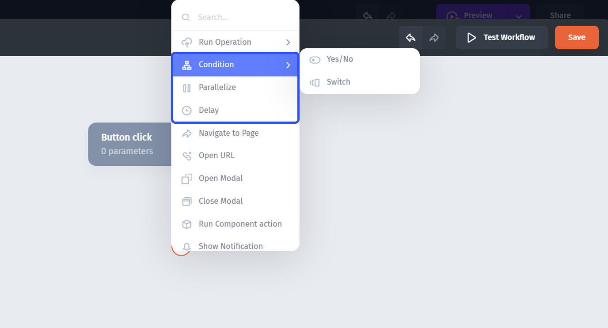

### Conditions

**Yes/No condition** creates two branches in the workflow tree and one condition which, if met, will run the "Yes" branch and if not met, will run the "No" branch.

In the majority of cases, to create a simple **IF rule**, you'll use the **EQ()** formula **(1)**. It has two values (arguments), that can be static or could be referenced dynamically from other components **(2)** or pretty much anywhere in the app.


If using **text** (string) for a condition, put it into the quotes "\_"


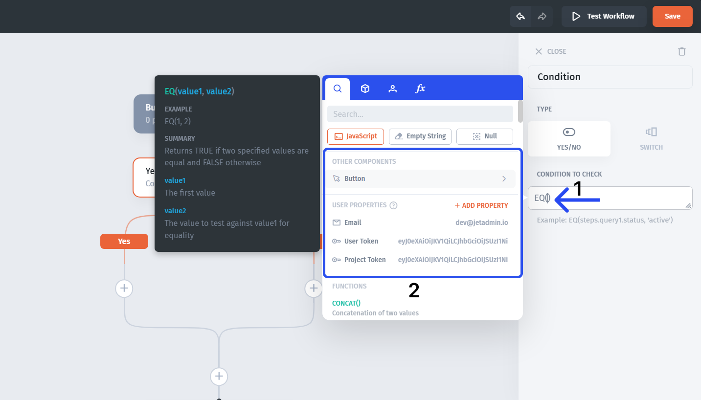

**Switch condition** allows to create multiple branches and set an individual rule for each branch. Only when an individual condition is met will the corresponding branch run.

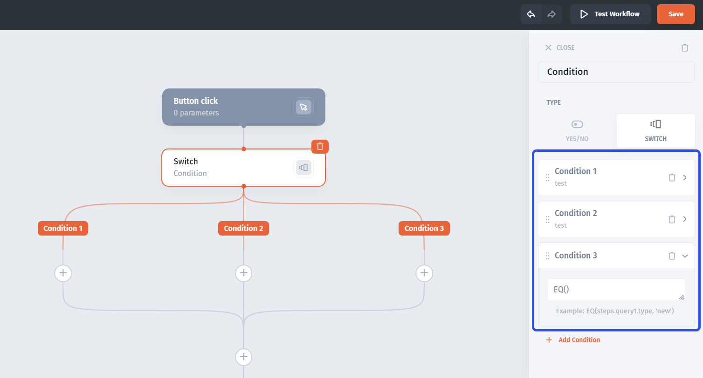

### Parallelize

This rule step allows creating multiple branches, all of which will **run simultaneously** (in parallel). It's effectively the same as the "Switch" rule, where each condition is set to "1" (true)

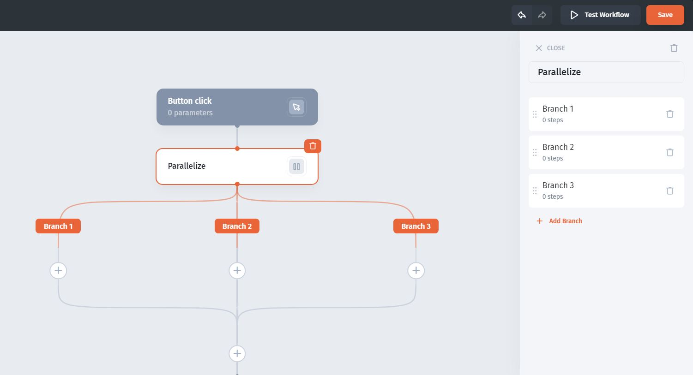

### Delay

With the **delay step**, you can insert a time lag between steps so that the next step will "wait" N seconds after the previous step is fired

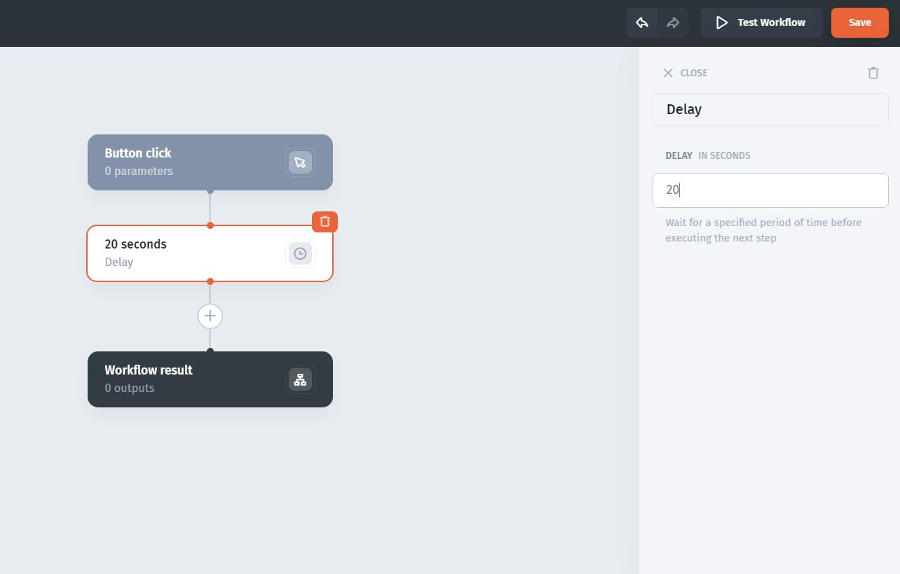

## Inputs, Outputs, and Parameters

Many cases that include workflows, especially the more complex ones, require you to be able to pass values **from the app into the builder** as well as pass values **from the builder into the app**.

A **simple example** would be a workflow that deletes a record and sends an email notification via Mailchimp:&#x20;

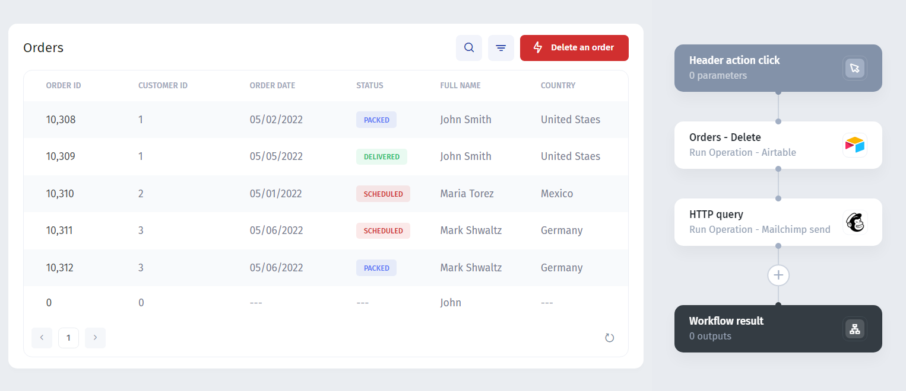

**To achieve that**, we'll need to fetch the `ID` (to identify what record to delete) and pass it into the "Orders - Delete" action in the workflow. We'll also need to pass the customer's email into the Mailchimp action (so that the notification is sent to the right person)


The **ID** (primary key), is a unique identifier of a record, which could be set in the data source, auto-generated by Jet, or set manually in Jet (depending on the data source). It is typically hidden in the table but available for the fetching and referencing in other components


There are two ways how we can **fetch** the `ID` from the selected row:

1. **Directly from the Step**
2. **Through the Workflow Parameters**

### **Directly from the Step**

Select the step **(1)** then click on the ID and click on "Formula" **(2)**.

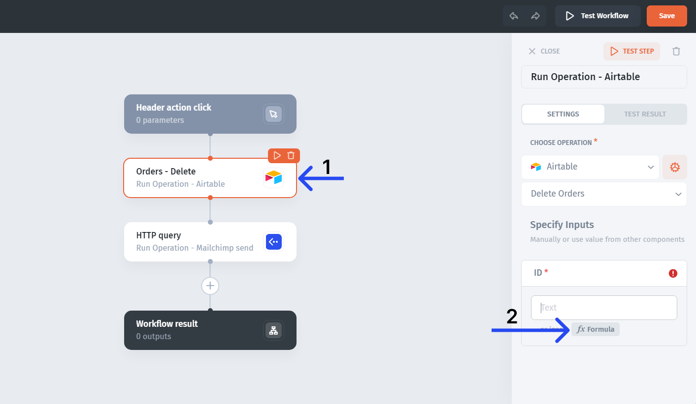


All the imputs available will be listed in the configuration menue on teh right for a given Step


### Through the Parameters

**Parameters** allow you to receive and hold different values from the app so that they can be referenced and used in the workflow steps.

**To add** a parameter, either go to the **trigger action menu**:

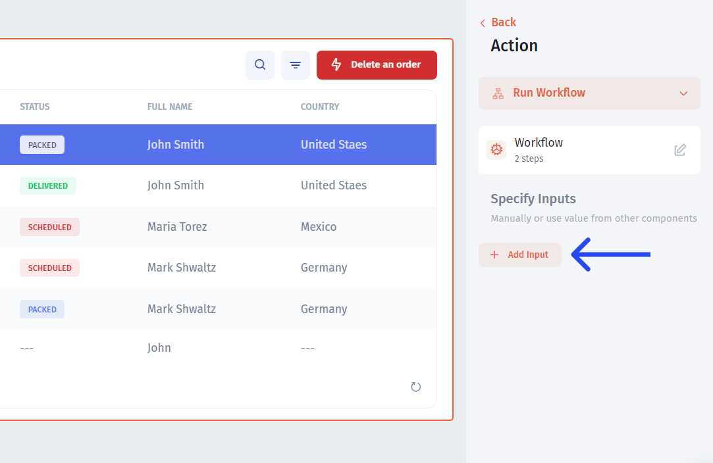

Or open the workflow builder and click on the trigger action step there:

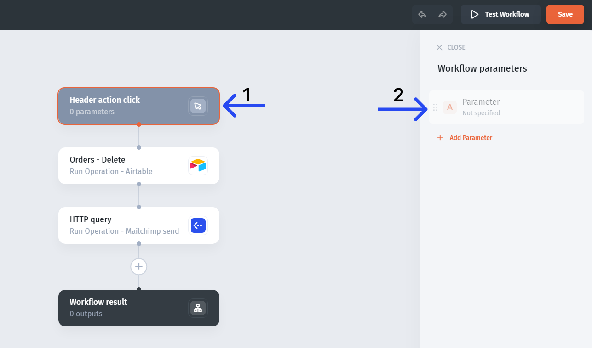

After that, **go back to the trigger action menu** (close the workflow builder), select teh created parameter **(1)** and reference any dynamic value from the app **(2)**.

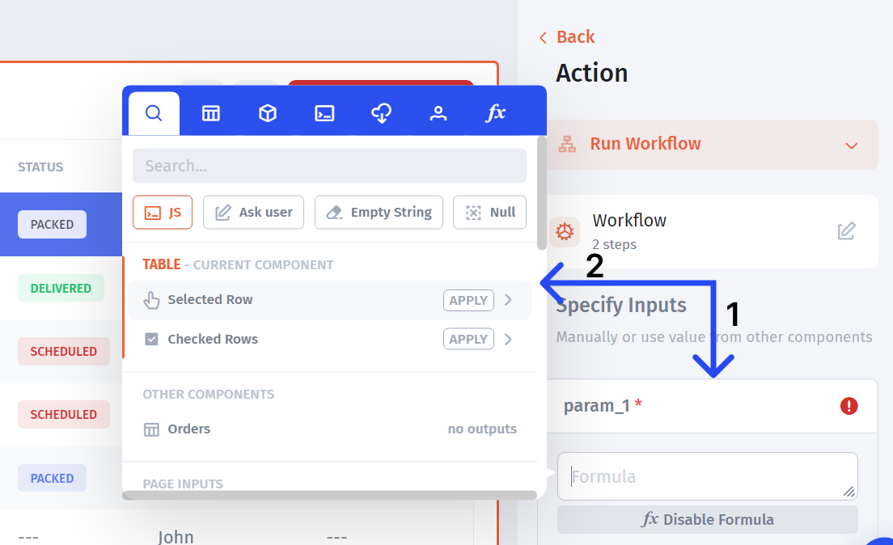

This will put the referenced value into the parameter. Then, you can fetch the stored dynamic from the parameter within an action step:

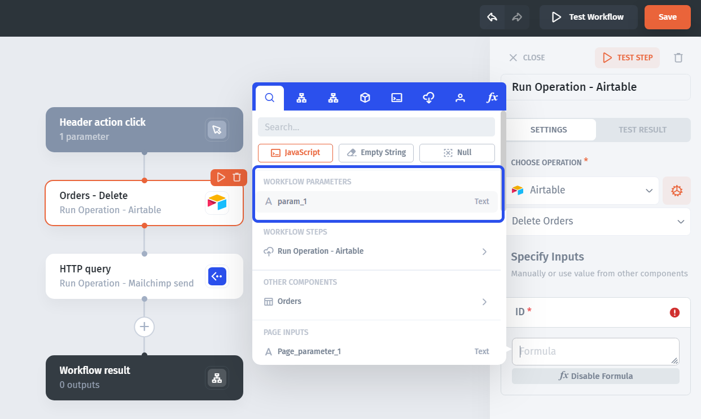

## Test & Debug

**To test** the workflow, you can either test individual steps **(1)** or the whole workflow **(2)**

If there are any **errors**, the step with the error will be highlighted **(1)** and you can go and see the error description in the "test" tab **(2)**

As the company is growing and the roles are diversifying, the need for some sort of a task management system for your internally-facing applications is increasing. So we came up with the **Approval Workflow** feature.


[task-approval.md](task-approval.md)


In JetAdmin you can create **Actions Workflow** that allow you to perform multiple actions immediately after performing the base action.


[actions-workflow.md](actions-workflow.md)


Create a **sequence of actions** in Zapier or Integromat by triggering through JetAdmin actions.


[action-sequences.md](action-sequences.md)

