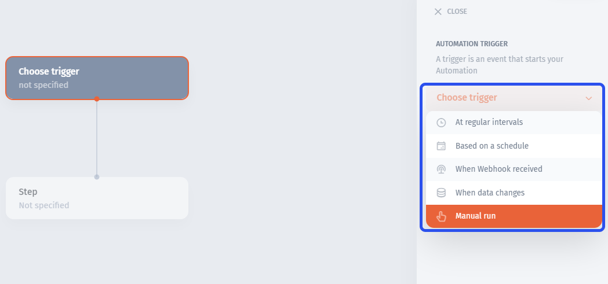
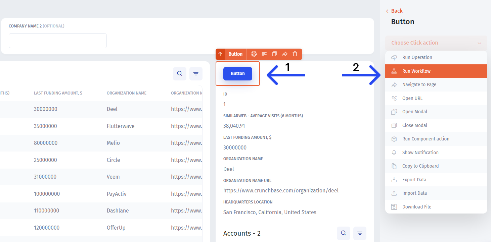
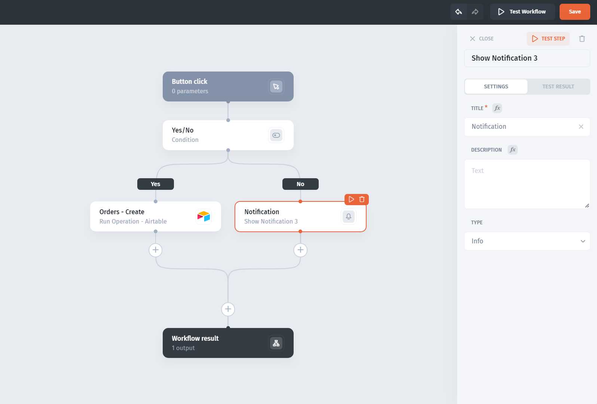
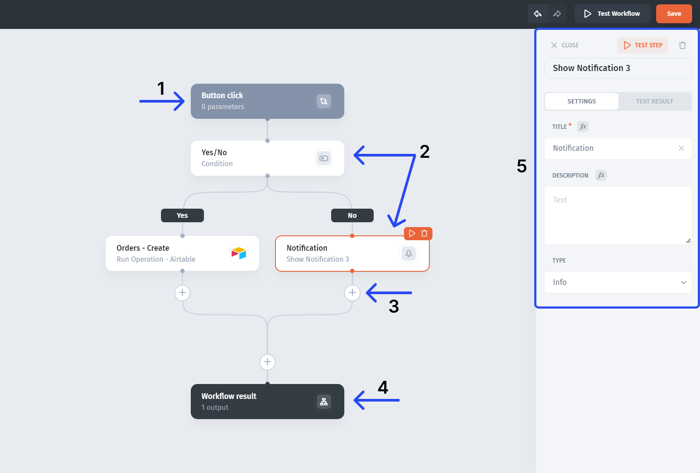

# ⚙️    Automations & Workflow




The **Automation** and the **Workflows** in their essence are the same product with the biggest difference  being the types of triggers (`Schedules, data chance, etc` vs a `button click`) and the place from which they're being set up


There are two places to initiate the creation of an Automation or a Workflow: the **Automation tab (1):**

<figure><figcaption></figcaption></figure>

Which you can use to create automation, triggered by time intervals, schedules, data change, webhooks, or a manual run:

<figure><figcaption></figcaption></figure>

And the **workflow builder (2)**, that is used solely for workflows, and can be set only from the action in the UI:

<figure><figcaption></figcaption></figure>


Automations (workflow builder) have just been launched. We've tried and tested it, but if you have any suggestions or issues with automation, please let us know in the chat!


**Automations** allow you to create a sequence (or workflow) of events that are executed based on a  specific trigger. Workflows consist of triggers and steps.

Here's an **example** of a workflow that is triggered when a button is clicked and then it either creates a record in Airtable or shows a notification based on whether the "Yes/No" condition is met.

## Overview

The workflow builder consists of several **key parts**:

**(1) Triggers** determine when (on what condition) the workflow will run. For example, this might be a button click or a row click in a table.&#x20;

**(2) Steps** consist of **actions**, which run sequentially when a workflow is triggered, and **rules**, which allow you to branch the sequence based on certain conditions. An example of an action would be "Updating a record in Airtable" and an example of a rule could be "If condition" that will divide a workflow into two branches.&#x20;

**(3)** You can add **new steps** before or after any step, just click the "+" icon

**(4)** **Workflow result** closes the sequence and can be used to configure the workflow outputs

**(5)** The **configuration tab** that opens up when you select a trigger or a step

## When to use it

For the most part, you'll need a single action, such as `changing a status` or `making a refund`. However, in specific cases, you'll need a whole sequence of actions to be executed, often involving conditional logic.

**Typical tasks** for workflows might include:

* Changing a user's status and sending a notification via Sendgrid
* Showing an error notification and sending a notification with details in Slack
* Getting to a specific page after submitting a form and downloading an attachment
* Making a refund via Stripe and: a) for transactions marked as "wrong item", create a new record in the "Coupons" Firebase collection and notify a manager via Slack b) for the rest change the status in the "Customers" collection&#x20;

## Build Automation

**Learn** how to build and test automation with dedicated sections:


[page-1.md](page-1.md)



[steps](steps/)



[inputs-outputs-parameters.md](inputs-outputs-parameters.md)



[test-and-debug.md](test-and-debug.md)


Also, **check the sections** that are not part of the workflow builder but can help you automate even more:

## Approval Workflow

Approval workflow is a **built-in** functionality that for any chosen action, allows to inject the **intermediate step of approval** before the action is executed. You can assign different people as the approval owners - they'll receive approval requests in their feed.

**Learn more** here:


[task-approval.md](task-approval.md)


## Success/Error Actions

In Jet, you can choose different **secondary actions** that are being executed depending on whether the initial action execution was successful or not.

**Learn more** here:


[actions-workflow.md](actions-workflow.md)


## Iterators

This workflow node will help you to go through a list of items to make actions individually.


[iterators.md](iterators.md)


## Zapier Workflows

Create a **sequence of actions** in Zapier or Make (formerly Intergomat) of any complexity using triggers within Jet.

**Learn more** here:


[action-sequences.md](action-sequences.md)

