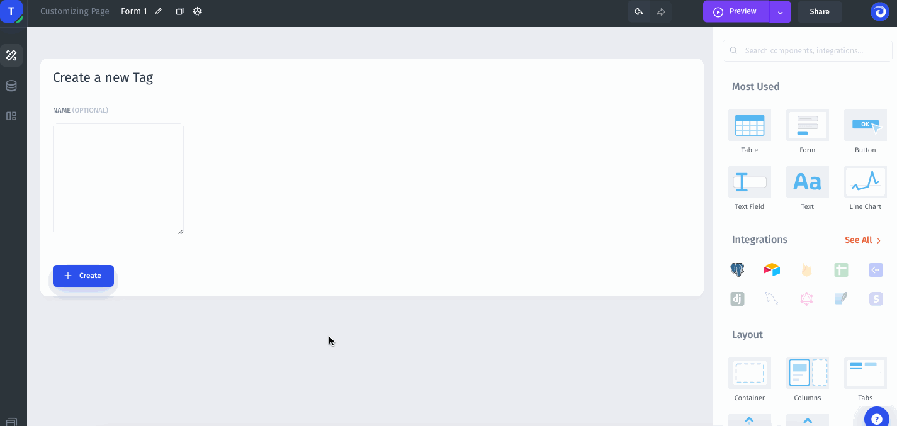
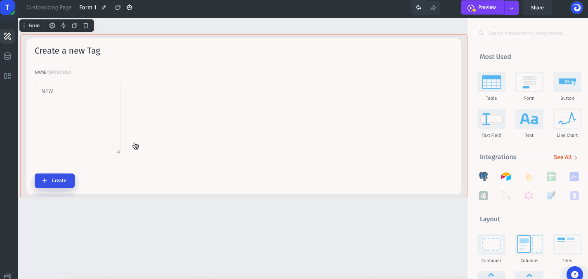
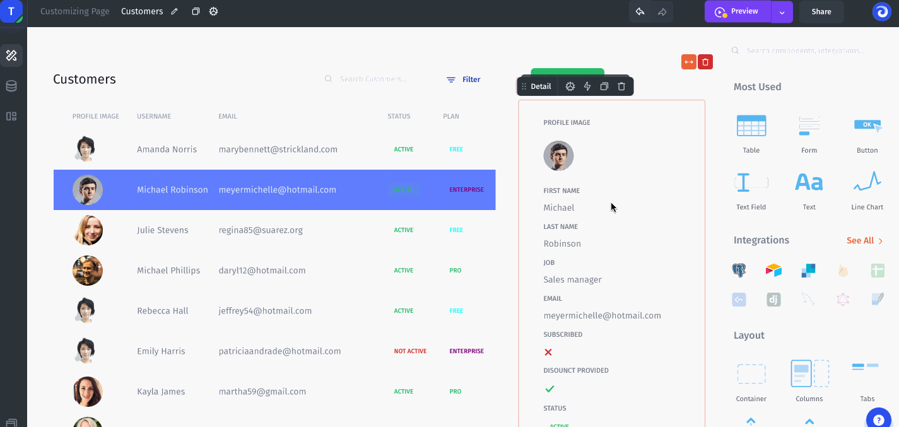

# Success/Error Actions

Let's assume a scenario where you would like to perform a specific action, e.g. immediately send an email to a user for whom you just changed the status.

In JetAdmin you can create **Actions Workflow** that allow you to perform multiple actions immediately after performing the base action.

When configuring the Button component, you will see the Actions tab where you can create special actions that should be executed when the base action has been executed **successfully** or has been executed with **errors**.

.png>)


Note that these operations are not performed sequentially but in parallel, so be careful when creating some dependent operations (one of them might be executed earlier without the required input data and such an operation will end with an error).


### Example 1: Automatic redirect to another page

Let's implement the following case where you would like to redirect your user to another page automatically when he/she has performed a specific action on the first page.

Suppose you want to create a sequence of forms to be filled out by your user. Let's set up an After Completion Action for the first button. For this purpose, let's add the **Navigate to page** action as an After Completion action:

Now after submitting the initial form, your users will be automatically redirected to another page.

### Example 2: Automatically sends an email after an action is completed

Suppose you want to automatically send an email to a user when some action is performed on his/her data, such as a status update. Let's implement it by adding **Run Operation** as an After Completion Action:


Now as soon as the status has been changed an email will be sent automatically.


See here how to use formulas to send a dynamic message, e.g. about the current and previous status.
