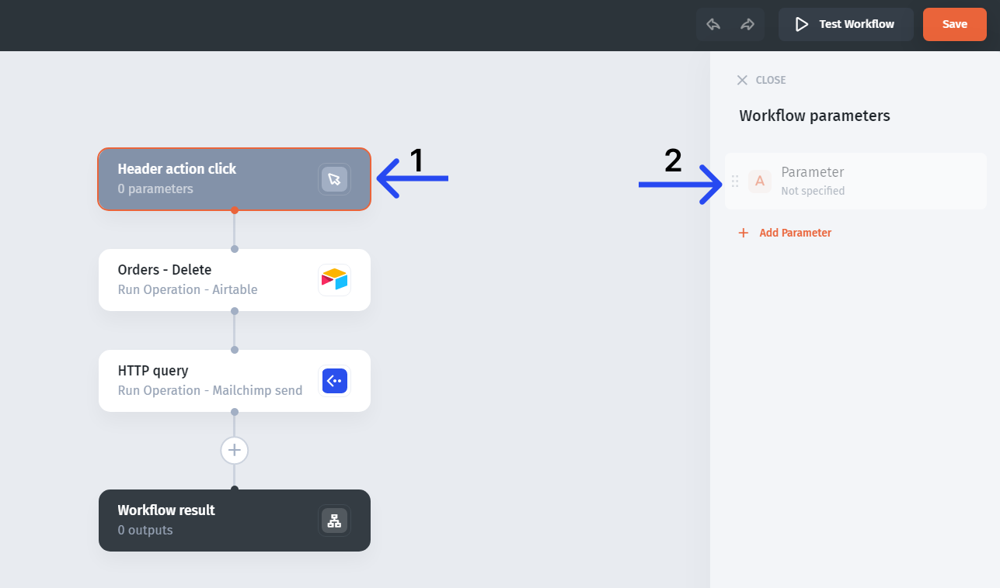
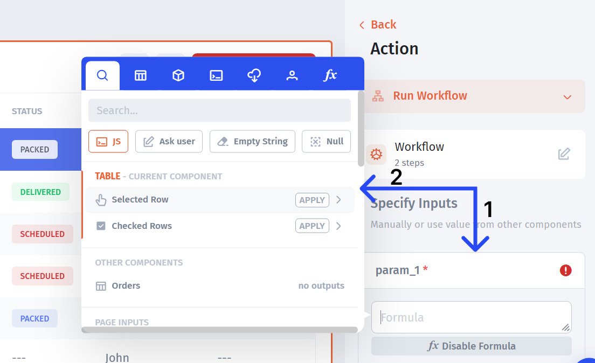

# Inputs, Outputs, Parameters

Many cases that include workflows, especially the more complex ones, require you to be able to pass values **from the app into the builder** as well as pass values **from the builder into the app**.

A **simple example** would be a workflow that deletes a record and sends an email notification via Mailchimp:&#x20;

**To achieve that**, we'll need to fetch the `ID` (to identify what record to delete) and pass it into the "Orders - Delete" action in the workflow. We'll also need to pass the customer's email into the Mailchimp action (so that the notification is sent to the right person)


The **ID** (primary key), is a unique identifier of a record, which could be set in the data source, auto-generated by Jet, or set manually in Jet (depending on the data source). It is typically hidden in the table but available for the fetching and referencing in other components


There are two ways how we can **fetch** the `ID` from the selected row (and other values and tokens):

1. **Directly from the Step**
2. **Via Workflow Parameters and Inputs**

### **Directly from the Step**

Select the step **(1)** then click on the ID and click on "Formula" **(2)**.


All the imputs available will be listed in the configuration menue on teh right for a given Step


### Via Parameters/Inputs

**Parameters** allow you to receive and hold different values from the app so that they can be referenced and used in the workflow steps.


#### Test Parameters

Using Test Parameters can make it easier to configure and test your workflow. Add test parameters by clicking on the first step of your workflow (i.e. the trigger step), then configure parameter types and enter test values.


**To add** a parameter, either go to the **trigger action menu**:

Or open the workflow builder and click on the trigger action step there:

After that, **go back to the trigger action menu** (close the workflow builder), select teh created parameter **(1)** and reference any dynamic value from the app **(2)**.

This will put the referenced value into the parameter. Then, you can fetch the stored dynamic from the parameter within an action step:

After that, you can reference (fetch) workflow parameters from any step, be it an action or a rule.&#x20;

**For example**, we can create a rule that will branch our sequence into two based on a condition: `IF` a transaction amount from a selected row is `>= $100`, the "Yes" branch will run, `ELSE`, the "No" branch will run:

Recap of the value's "journey" in our example

So the amount value has been fetched from the selected row of the "Transactions" table, then been put into the "Input" in the Trigger action, then retrieved in the workflow "Parameter\_1" and then been referenced in the "Yes/No" condition in the formula

### **Outputs**&#x20;

**Outputs** allow you to fetch and store the results from specific steps in the automation. You can later reference those outputs from within the app.&#x20;

You can use the **last step** outputs (default) **(1)** or specify the outputs manually **(2)** so that you can get the results from the specific steps **(3)**.

You can go futher and **combine and transform** results using the functions modal:

##
