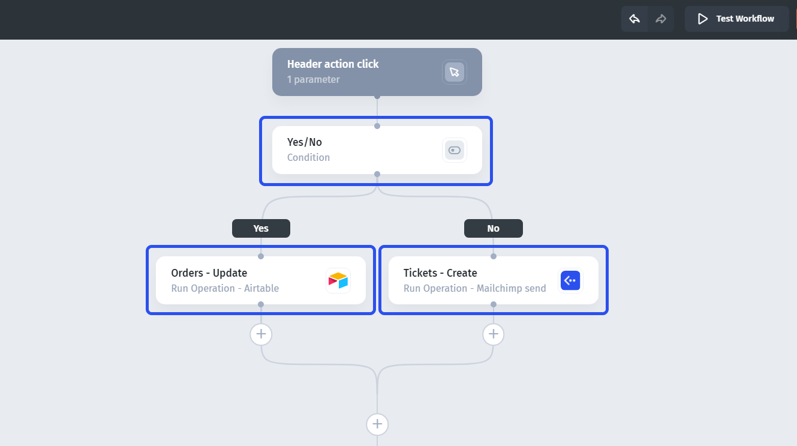

# Steps

**Steps** are the building blocks of the workflow - they execute specific tasks, whether it's change a record, make an API call, or show a notification.

Steps consist of **actions** and **rules**. An example of an action would be "Updating a record in Airtable" and an example of a rule could be "If condition" that will divide a workflow into two branches.&#x20;

**Learn more** here:


[actions.md](actions.md)



[rules.md](rules.md)

