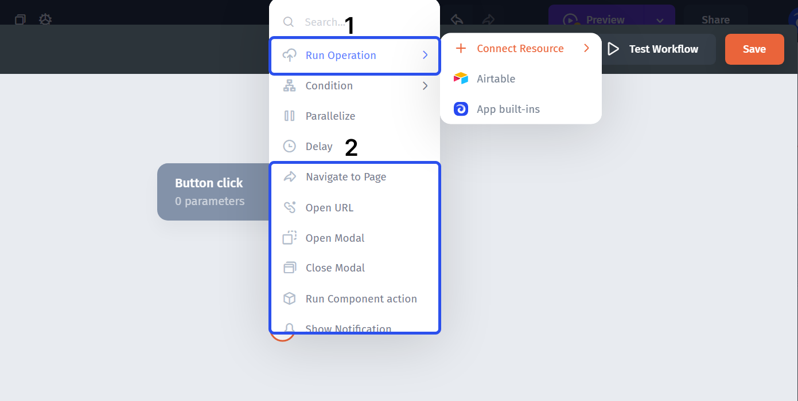
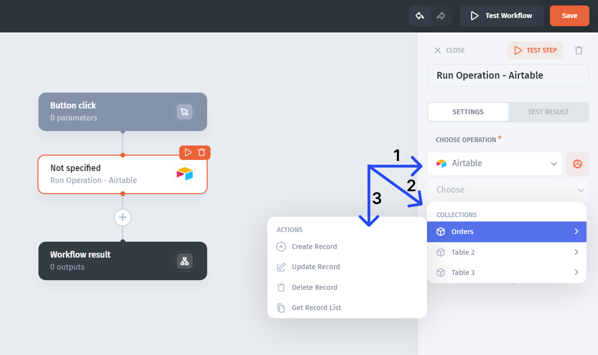

# Actions

To add an action step (or a rule step), just click on the "+" icon:

Then you can choose from the **list of operations** (actions) for the step. There are two major categories of actions:

* **(1) Data actions** - allow you to interact with the data, that's connected to Jet
* **(2) In-app actions** - service operations like navigating to a page or showing a notification


**App built-ins** allow you to create actions for users and teams (groups of users)


For the **Data actions**, once the step is added, you can configure the resource **(1)**, the collection (table) **(2)**, and the action **(3)**:

##
