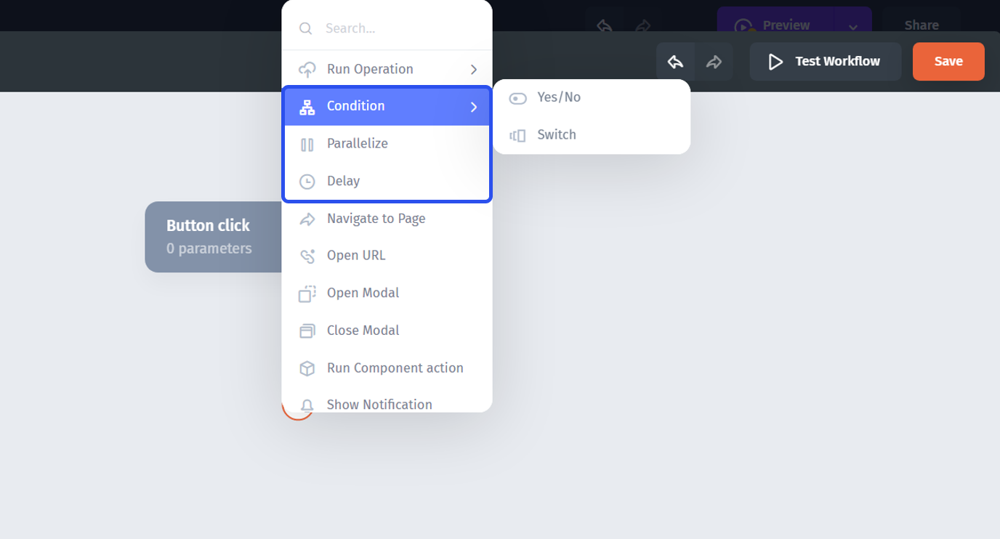
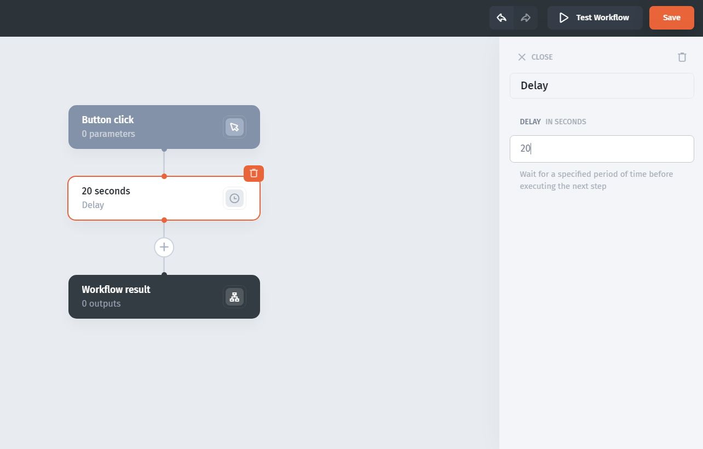

# Rules

Rule steps allow you to run alternative or simultaneous sequences based on specific conditions.

There are three types of rule steps:

* **Conditions** - allows you to set up a conditional logic that will create and (later) run different workflow branches based on whether a condition (or conditions for the "Switch") is met
* **Parallelize** - allows running multiple branches in parallel, simultaneously
* **Delay** - can specify the delay (in seconds) between the steps

### Conditions

#### **Yes/No condition**&#x20;

It creates two branches in the workflow tree and one condition which, if met, will run the "Yes" branch and if not met, will run the "No" branch.

In the majority of cases, to create a simple **IF rule**, you'll use the **EQ()** formula **(1)**. It has two values (arguments), that can be static or could be referenced dynamically from other components **(2)** or pretty much anywhere in the app.


If using **text** (string) for a condition, put it into the quotes "\_"


#### **Switch condition**&#x20;

It allows to create multiple branches and set an individual rule for each branch. Only when an individual condition is met will the corresponding branch run, or you can set an _ELSE_ condition to run when other conditions are not met.

### Parallelize

This rule step allows creating multiple branches, all of which will **run simultaneously** (in parallel). It's effectively the same as the "Switch" rule, where each condition is set to "1" (true)

### Delay

With the **delay step**, you can insert a time lag between steps so that the next step will "wait" N seconds after the previous step is fired

##
