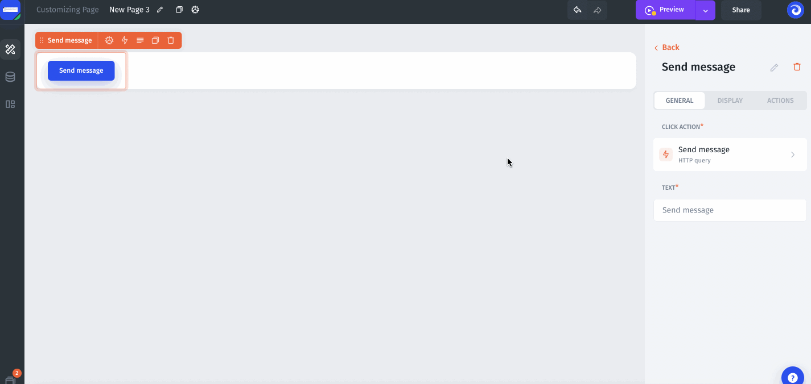
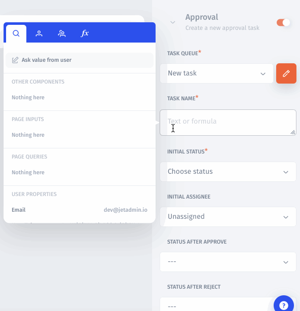

# Approval Workflow

As the company is growing and the roles are diversifying, the need for some sort of a task management system for your internally-facing applications is increasing. So we came up with the "Task Queue" feature.



### How it works

There are certain actions that you wouldn't want your support team to have the full authority over as the price for the error is really high. In that case, you can create an _approval workflow_.  Such a workflow would help:

* route approval requests to the approver
* provide the approver with information pertinent to the case
* make it a rule that certain actions can only be performed if approved
* optionally, enable communication within the approval process&#x20;

Here's the setting: your customer wants his money back. You scroll through the customer list, find the one to return the money to and select the transaction to be refunded. Now you press the Refund button to make it happen, but here's an approval workflow baked in to this process. Therefore, instead of just sending the charged amount back to the customer's account, pressing of the Refund button creates a task yet to be approved. You will be presented with a message informing you of the fact, and once you give your consent to the approval requirement, there's a task in the approval tasks queue.

### Create a new task queue

To start off, we need to create a new task queue. To do this, go to the settings of the Button component, select the Actions tab and activate Approval feature for this button:

Enter the name of the task and set statuses that will represent the stages and outcomes of the workflow: the most common statuses would be "new", "in progress" and "completed".&#x20;

### Configure the task queue parameters

You can pass helpful information to the task from the application so that the approver could make a better decision of either approving or rejecting a task.

Technically, every meaningful bit of information can be presented to the approver through a corresponding parameter, such a `transaction id` or a `customer id`:

.png>)

A task queue being formed, you can perform that action from a Jet Admin application to the approval queue to require the approval from the team leader or whoever you set as the assignee of the task.

### Create an approval task

First, select the task queue that we've created in the previous steps. For the "**Task Name**" you can either type a name or use formulas to use the dynamic values from the page. "**Initial status**" sets the status that the assignee will see in the task queue list and in the task queue details. "**Status after approve**" and "**Status after reject**" are the statuses that the task will change to after approval and rejection correspondingly. And the initial assignee is the person who should receive this task in their task queue and decide whether to approve or reject the task:

### Pass parameters

The next thing to do is to pass parameters that the assignee will see in the task details before making the decision. Those might be the amount of the transaction to refund, the account status or any other value from the page or a formula. You can add as many parameters as you need.

.png>)


[parameters](../parameters/)


### Approving and rejecting the tasks

Now, every time a user clicks on the "Refund" button, a task would be created and passed over to the task queue feed of the chosen assignee. To see the list of tasks you need to open the collaboration page:

### Organizing the tasks

You can filter tasks by the assignee and the date as well as by the priority. "Priority" is the attribute of the task set by the assignee to help determine how important the given task is.

### Managing the tasks

After organizing the tasks the assignee can click on the task and view and change the details of the task. The parameters sent along with the task for the given action will appear in the "Details" section:

### Approving and rejecting tasks

The final step of the workflow is either approving or rejecting the task. Hitting "Approve" will deploy the action that the task has been created for (in our case the refund) and change the task status. Pressing "Reject" will just change the status of the task.&#x20;

