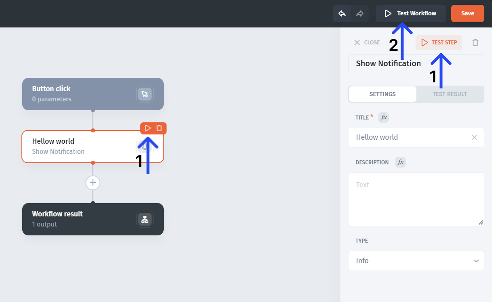
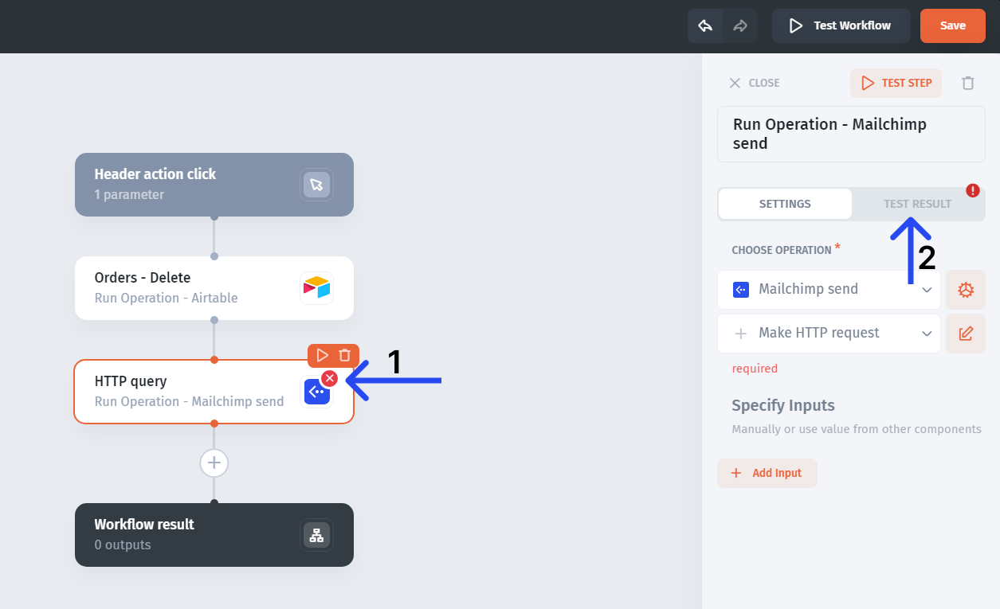

# Test & Debug

**To test** the workflow, you can either test individual steps **(1)** or the whole workflow **(2)**

If there are any **errors**, the step with the error will be highlighted **(1)** and you can go and see the error description in the "test" tab **(2)**

