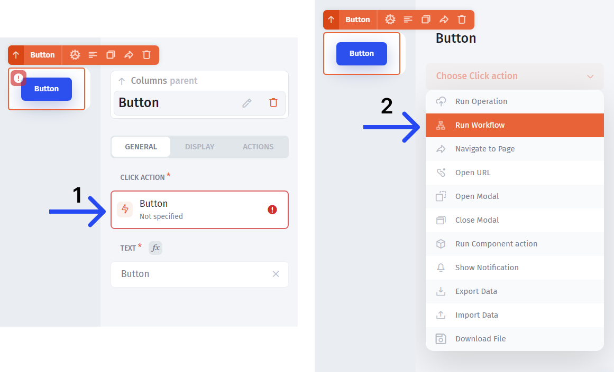
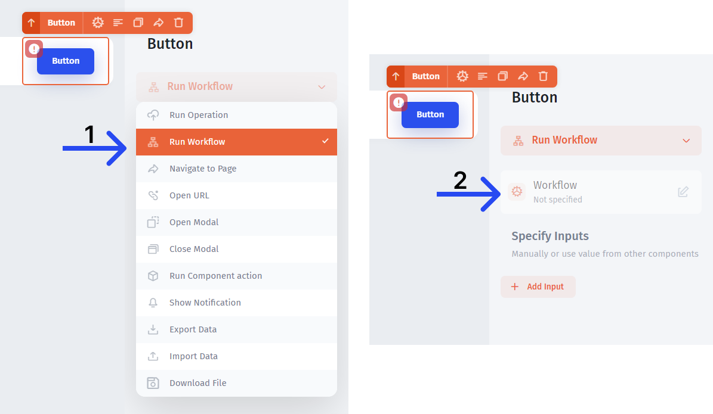

# Triggers

To start building automation, **select the trigger** which will initiate it. Triggers can be broadly divided into three categories:&#x20;

* **Buttons**
* **List actions**
* **Success/Error actions**

### Buttons

The most common one is `button`. To create an automation, click on the "Click action" **(1)** and then choose "Run Workflow" **(2)**.

### List Actions

You can also create automation for any of the **list actions**. The lists include `Table`, `Map`, `Kanban`, `Gallery`, `Timeline`, and `Calendar`.

### Success/Error actions

Another type of an action that can trigger workflows is `Success/Error`:

.png>)

In all the cases, you'll need to **choose the "Run workflow"** type of action **(1)** and click on the workflow section **(2)**:

##
