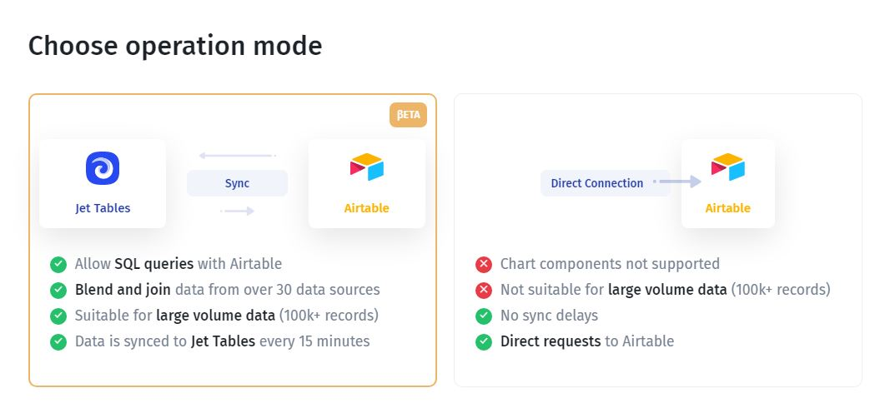

# Airtable

In this article, we'll review the integration with Airtable, and its characteristics and will go through the steps necessary to connect it to Jet Admin



###


**API keys are deprecated by the end of January 2024.**&#x20;

Airtable's API keys stopped working and you will have to migrate to **personal access tokens**. **Personal access tokens** allow you to more securely grant API access to Airtable data.


### Connecting Airtable

You can connect to Airtable from the data tab on the left menu bar or from the data section within a UI component. You'll need to enter a valid personal access token, and choose a base.

### Obtaining a personal access tokens

You can obtain your personal access token on[ Airtable's account page](https://airtable.com/account), then follow the steps below:

1. Go to the API section
2. Click on '[Go to developer hub](https://airtable.com/create/tokens)'
3. Click on 'Create token'
4. Create a new token
5. Copy and save the token in a safe place.

<figure><figcaption></figcaption></figure>


When creating a new 'personal access token', please make sure you choose the 'data.records:write' scope if you need to view, add, edit, and delete records on Jetadmin's side.


<figure><figcaption></figcaption></figure>

### Connect Airtable to Jetadmin&#x20;

1. On Jetadmin's builder side, click 'Add Resource' from the data section on the left-side menu
2. Choose Airtable
3. Click on 'Sign In to Airtable' button
4. Click on 'Add a base'&#x20;
5. Choose the needed base or workspace
6. Click 'Grant access'
7. Choose the base needed
8. Click the 'Choose tables' button
9. Select/unselect the needed tables and choose a **view** for each table
10. Click the 'Add Resource' button.



### Choosing connection mode&#x20;

After that, you need to choose how you'd like your Airtable to be integrated with Jet Admin. You can either connect directly or **sync it** with Jet's internal database to get extended functionality.&#x20;

If you want to be able to **combine your Airtable data** with data from other data sources, such as Firebase, Google Sheets, or even REST API within the same tables, you should choose the **"Sync" connection** for Google Sheets. You can learn more about it here:

After having connected your Airtable, you'll be prompted to choose pages you want Jet Admin to generate **an admin panel (CRUD pages)** for.&#x20;

### Airtable Views

On Airtable side, you can create different views for each table. Each view allows you to filter and sort records. In Jetadmin you can choose to use only one view for each table when creating the resource. To view all records in each table, choose the main view 'All'.

The image below will show you the differences between the main view and the filtered views:

<figure><figcaption></figcaption></figure>

### Switch Airtable's Views

To switch to other views for each table, follow the steps below:

1. Click 'Edit resource' from the resource's settings menu
2. Click on 'Choose tables'
3. Select the needed views for each table
4. Click 'Update resource'.

<figure><figcaption></figcaption></figure>
