# What’s New

Explore the latest features and improvements in Jet Admin.



## Start with a template and take control of your app’s changes

September 2026 · AI App Builder · Development preview

This month’s builder updates focus on getting your app started and refining it as you go. Choose a template, adjust its appearance, and review changes before keeping them.

### 🧩 Start from a template

Choose a starting template and build on its app structure. Updates to the generation flow help the assistant request a data connection and use the resource you’ve connected.

<figure>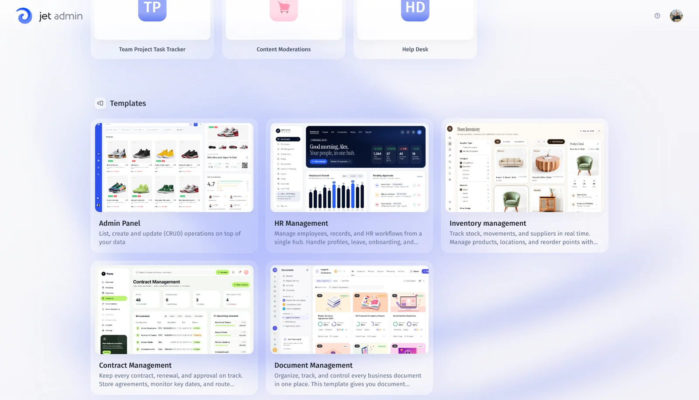<figcaption>
Template selection
</figcaption></figure>

<figure>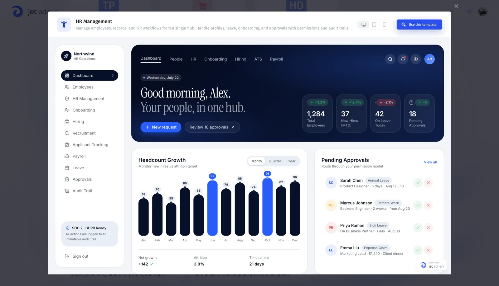<figcaption>
HR Management template preview
</figcaption></figure>

### 🎨 Adjust your app’s appearance

Use the theme editor to customize your app’s appearance as you build.

<figure>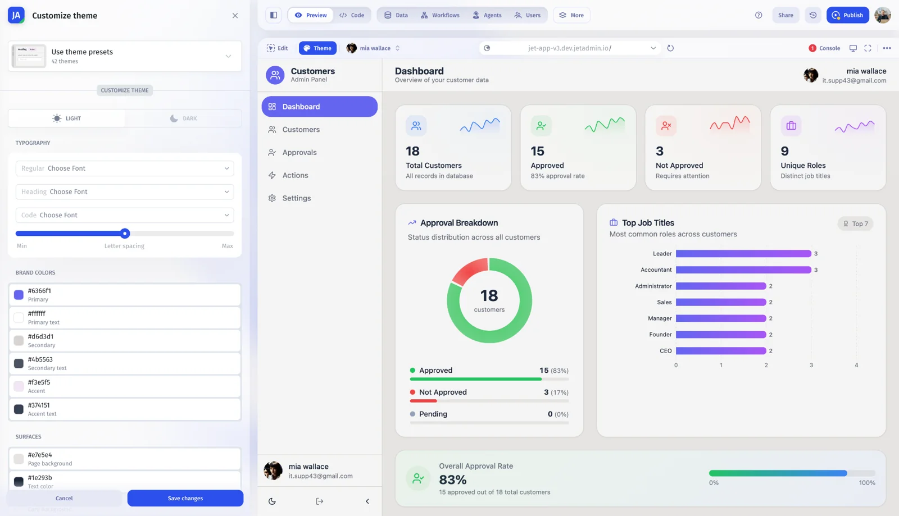<figcaption>
Theme editor
</figcaption></figure>

### 🕓 Review changes before keeping them

Inspect uncommitted changes in version history, create a saved version, or discard edits you don’t want to keep. This gives you a clearer point to review the work before continuing.


[overview.md](ai-app-builder/overview.md)




## A more flexible builder that helps you keep working

August 2026 · AI App Builder · Development preview

The Jet Builder v3 beta work brings a responsive layout, a dark theme, and improvements to reconnecting and recovering your work. Navigation and workflow visibility are also getting more attention.

### 📱 Build across screen sizes

Use the responsive builder layout on smaller screens and switch to a dark theme. The responsive layout is an initial version.

<figure>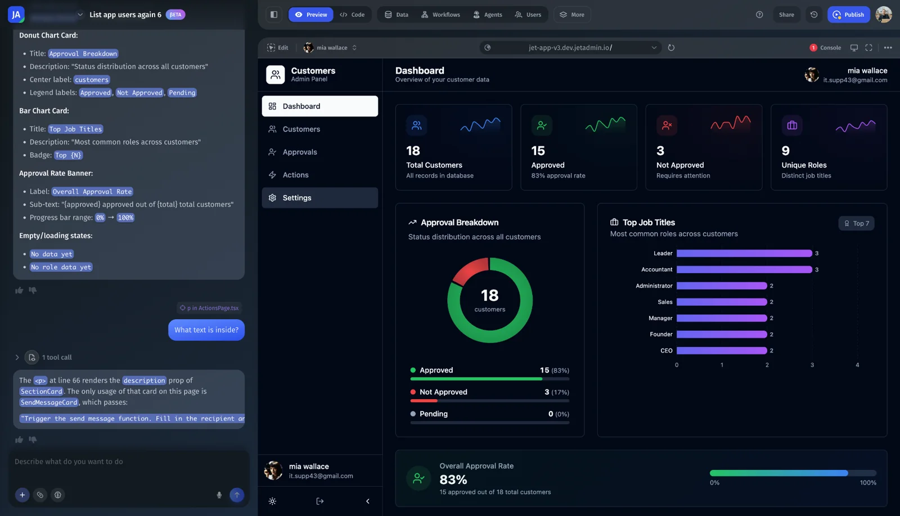<figcaption>
Builder dark theme
</figcaption></figure>

<figure>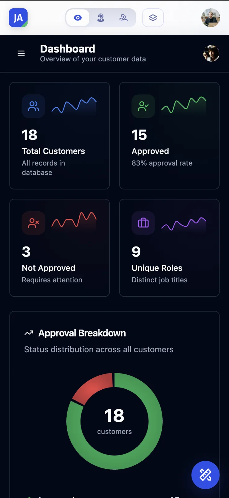<figcaption>
Builder on mobile
</figcaption></figure>

### 🔄 Reconnect and recover your session

Reconnect to the builder after an interruption and restore execution state after a reload. Tool results remain available in the conversation, and errors can be reviewed in chat.

### 🧭 Navigate your app and workflows

Move between routes in the preview, inspect version changes, and open the workflows list from the builder. Workflow logs give you more context when reviewing a run.

### 💳 See your remaining credits

See the credits left while you build and access billing and upgrade options from the builder.


[overview.md](ai-app-builder/overview.md)



[how-credits-work.md](account/credits-and-rate-limits/how-credits-work.md)




## Build connected apps and review them before publishing

July 2026 · AI App Builder · Development preview

July’s Jet Builder v3 work connects the app-building experience with data, permissions, and automation. Preview your pages, review the assistant’s prompts, and prepare your app for publishing.

### 👀 Preview the page you’re working on

Select a page in the builder and inspect it in preview. Review the result as you refine the app, then use the publishing flow when it is ready to share.

<figure>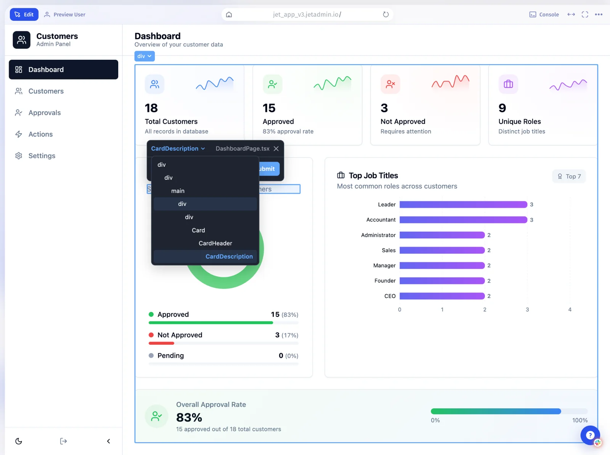<figcaption>
App page selection
</figcaption></figure>

<figure>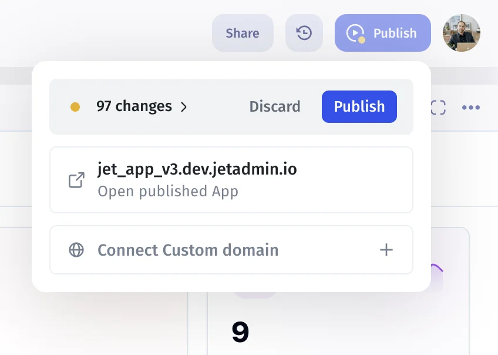<figcaption>
Publish controls
</figcaption></figure>

### 🔐 Work with users and permissions

Use the assistant to work with users, teams, and their properties. Configure collection and action permissions as part of the app’s setup.

### ⚙️ Connect data and automation

Bring synced resources into the building flow and work with functions and triggers through the assistant.

### ✅ Review the assistant’s next step

Confirmation prompts give you a point to review the assistant’s proposed action. Updated app navigation and user settings make it easier to move around the builder.


[overview.md](ai-app-builder/overview.md)



[triggers.md](workflow/triggers-steps-and-parameters/triggers.md)




## Connect more tools and see what changed in your project

June 2026 · Integrations & Governance

June’s updates expand the tools you can connect and the project activity you can review. Action forms also make inputs easier to understand and configure.

### 🔎 Track more project activity

Audit logs cover changes to users and groups, resources, agents, workflows, environments, and project settings. Use the activity history when investigating how a project changed.

<figure>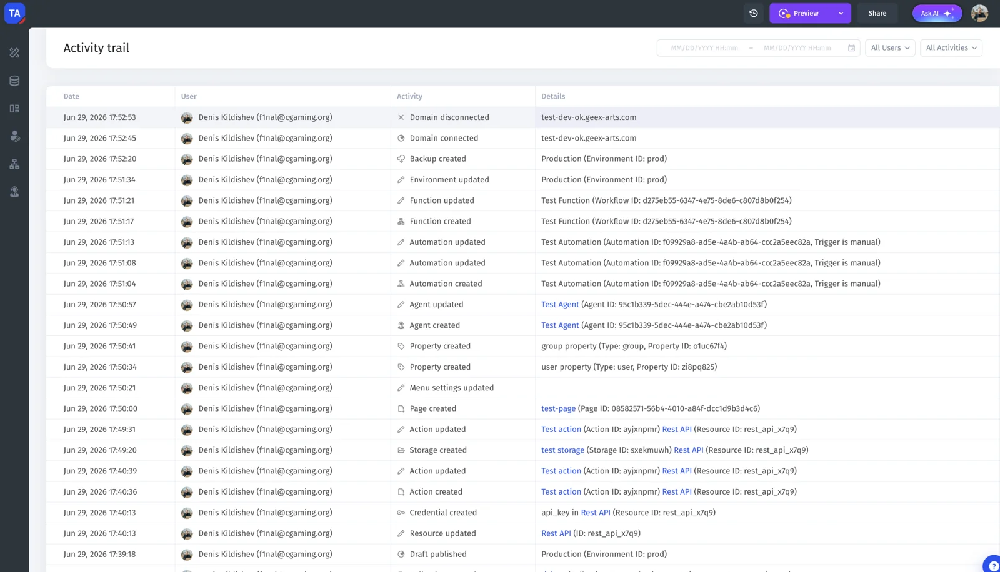<figcaption>
Project activity trail
</figcaption></figure>

### 🔌 Connect more of your tools

New MCP connections include Apify, Ahrefs, Confluence, Webflow, and Exa. Jet-managed resources also add Mapbox, Apollo, Brandfetch, Exa, FullEnrich, and Reducto.

MCP connections and Jet-managed resources are separate connection options. Check the relevant integration guide for setup and billing details.

### 🎛️ Configure action inputs with more clarity

See field descriptions alongside inputs, enable optional fields, and explicitly send a null value. Structured array and object parameters are displayed as fields for supported MCP actions.

### 💬 Respond to the assistant more easily

Suggested response options help you answer assistant questions. Updated message formatting makes quotes, tables, and tool responses easier to read. Jira triggers are also included in the integration updates.


[audit-logs.md](access-and-sharing/audit-logs-privacy-and-security/audit-logs.md)



[triggers.md](workflow/triggers-steps-and-parameters/triggers.md)




## Give your agents more knowledge and more ways to work

May 2026 · AI Agents & Workflows

Bring agents into your existing tools, give them relevant knowledge, and connect their work to changes in your data. May also adds skills, Python execution, and conversation file previews.

### 📬 Use agents through email and MCP clients

Give an agent an email address or connect it to an MCP-compatible client. An “Ask Agent” workflow step can send its reply back to an external channel.

<figure>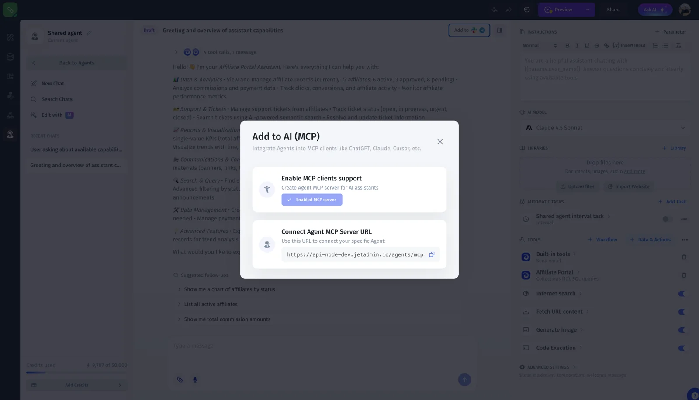<figcaption>
Connect an agent to an MCP client
</figcaption></figure>

### 📚 Add knowledge from websites and text

Import website content into a library or paste text from your clipboard. Keyword search complements AI Search, and resource tools show their sync status.

### 🛠️ Add skills and run Python

Give agents additional capabilities with Agent Skills. Python support in Execute Code adds another way to process information during a task.

### 📄 Preview files in the conversation

Open previews of PDFs, Word documents, spreadsheets, and HTML files directly in the conversation to review the result in context.

<figure>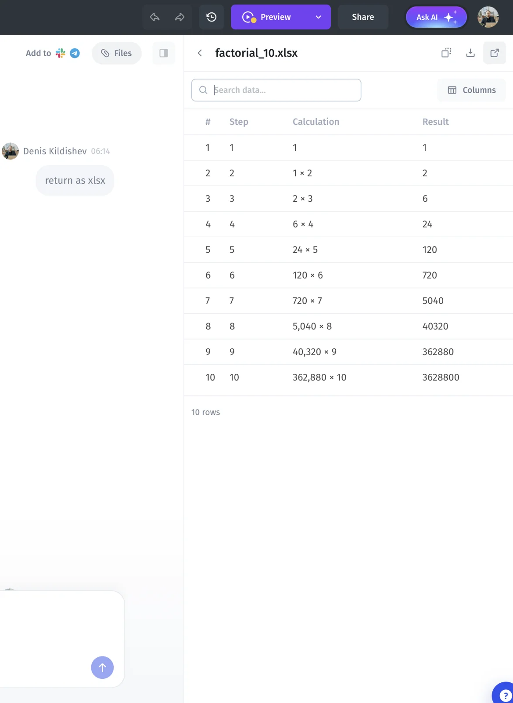<figcaption>
Spreadsheet preview in an agent conversation
</figcaption></figure>

### ⚡ Run workflows when your data changes

Use resource triggers to start workflows when connected records change. Resources with trigger support can also use automatic real-time sync, with updates for Attio, Asana, HubSpot, and Intercom.


[using-agents-with-email.md](ai-agents/slack-telegram-email-and-mcp/using-agents-with-email.md)



[using-agents-with-mcp-clients.md](ai-agents/slack-telegram-email-and-mcp/using-agents-with-mcp-clients.md)



[library.md](ai-agents/agent-templates/library.md)



[agent-skills.md](ai-agents/instructions-tools-skills-files-and-models/agent-skills.md)



[triggers.md](workflow/triggers-steps-and-parameters/triggers.md)




## Keep an eye on credits and use agents on mobile

April 2026 · AI Agents

April’s updates make agent usage easier to follow and improve the experience on smaller screens.

### 💳 See your agent’s balance

Check the current balance on the agent page and choose a credit tier in billing.

### 📱 Use agents on the go

Updated mobile layouts cover agent onboarding, conversations, billing, usage, and connecting resources.

<figure>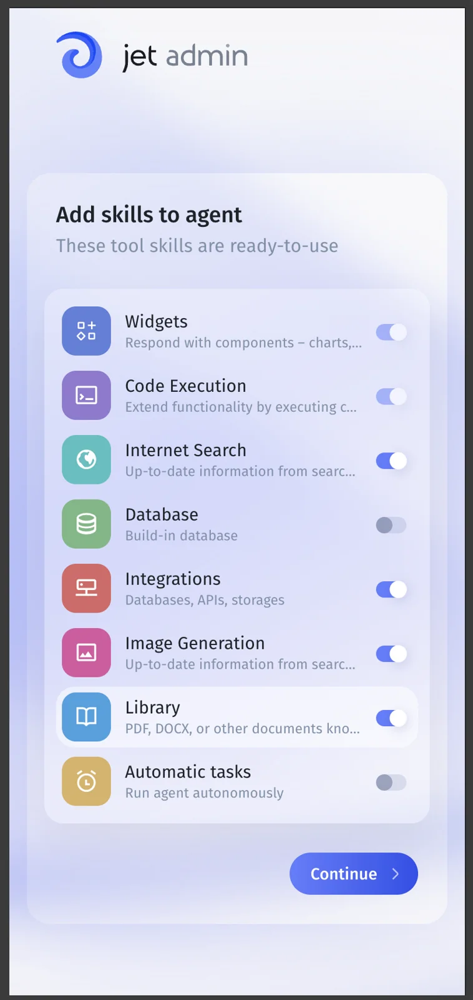<figcaption>
Agent onboarding on mobile
</figcaption></figure>

<figure>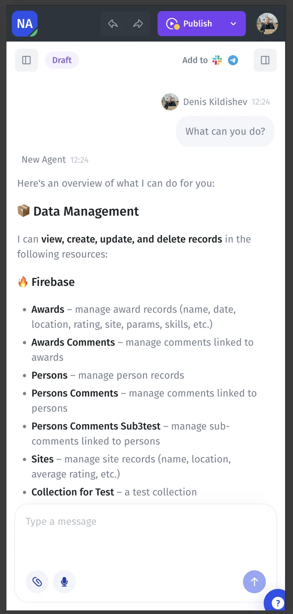<figcaption>
Agent conversation on mobile
</figcaption></figure>


[how-credits-work.md](account/credits-and-rate-limits/how-credits-work.md)




## Documentation updates

### 15 September 2026: AI-first guide structure

The guides now start with building an app using Prompt Assistant. Added focused articles for prompts, data connections, safe testing, publishing, agent setup, and governance. Classic App Builder remains available for existing drag-and-drop projects.

### 14 September 2026: Migration guides

Added [Migrating a project to Jet Admin](https://docs.jetadmin.io/getting-started/migrating-a-project), with guides for [Salesforce](https://docs.jetadmin.io/getting-started/migrating-a-project/salesforce), [HubSpot](https://docs.jetadmin.io/getting-started/migrating-a-project/hubspot), [Shopify](https://docs.jetadmin.io/getting-started/migrating-a-project/shopify), [Stripe](https://docs.jetadmin.io/getting-started/migrating-a-project/stripe), and [Airtable](https://docs.jetadmin.io/getting-started/migrating-a-project/airtable).

The guides cover connection setup, direct and sync modes, prerequisites, and troubleshooting. The overview explains data blending and its read-only limits. We also revised the articles for clarity and restored their links back to the overview.

## Product release archive

These entries summarize previously published announcements. See the [product changelog](https://feedback.jetadmin.io/changelog) for the archive.

### 13 February 2024: SmartSuite, GPT-4, and confirmation dialogs

Added a SmartSuite integration for building internal and customer-facing apps. The OpenAI integration added GPT-4 support, and actions gained customizable confirmation dialogs.

[Read the announcement](https://jetadmin.canny.io/changelog/new-in-jet-admin-smartsuite-gpt4-confirmation-dialogs-and-more).

### 30 January 2024: Figma import

The Figma to Jet plugin imports Figma designs as Jet Admin components. You can add interactions, connect data, and publish the app.

[Read the announcement](https://jetadmin.canny.io/changelog/design-in-figma-launch-in-jet-admin).

### 17 January 2024: Component Designer

Introduced Component Designer for custom components, including states, styling, event handling, and data connections.

[Read the announcement](https://jetadmin.canny.io/changelog/pixel-perfect-apps-component-designer).
