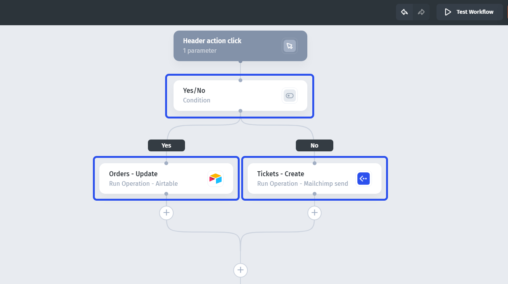
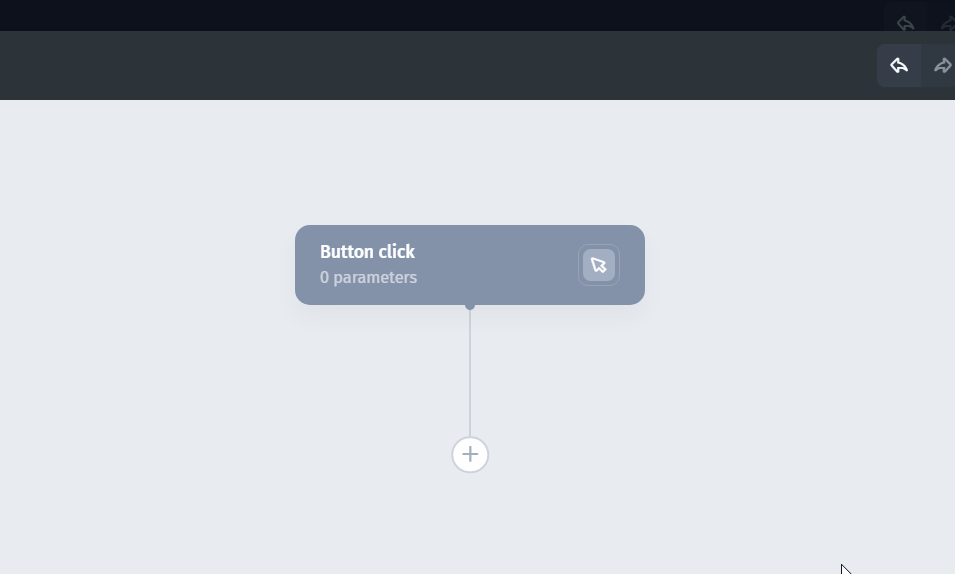
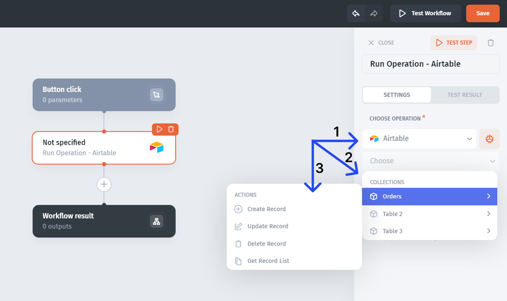

# Add and configure actions

An action performs a task such as reading data, updating a record, or navigating to an app page. A workflow step contains an action or a rule.

## Add an action

1. Click **+** at the position where the step should run.
2. Choose the action.
3. For a data action, choose the resource, collection, and operation.
4. Configure required fields, filters, and record identifiers.
5. Bind dynamic fields to [workflow inputs](../pass-inputs-into-a-workflow.md) or [earlier step outputs](../use-step-outputs-and-return-results.md).
6. Test the step and inspect the result before adding a dependent step.

## Example: update a ticket

Choose the Tickets collection and its update operation. Bind the record ID to `ticket_id` and set `status` to an allowed value in that source.

Do not use a row's position as its record identifier. Confirm the operation targets the intended ID, particularly after sorting or filtering a list.

## Choose the right action

See the [action reference](action-reference.md). In-app actions, such as page navigation, belong to an interactive app context; do not assume they are meaningful in a background automation.

If a step fails, inspect its input and error before running it again. A test of a write action can change data. See [Test steps and complete workflows](../../test-and-troubleshoot/test-steps-and-complete-workflows.md).
