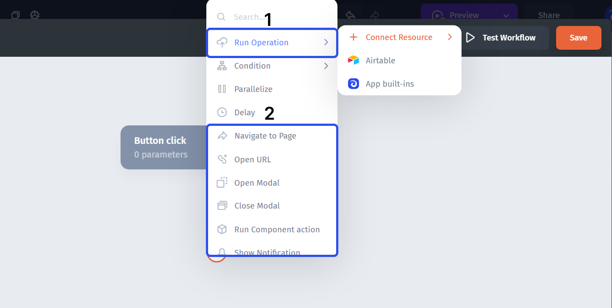

# Action reference

Use this reference to choose an action category. For configuration steps, see [Add and configure actions](./).

| Category       | Purpose                               | Typical configuration                                         |
| -------------- | ------------------------------------- | ------------------------------------------------------------- |
| Data actions   | Read or change connected data         | Resource, collection, operation, record ID, fields or filters |
| In-app actions | Respond in an interactive app         | Target page or notification content                           |
| App built-ins  | Perform operations exposed by the app | Inputs required by the selected built-in operation            |

Available operations depend on the selected resource and action context. Inspect the fields shown after selecting an operation instead of assuming every connector supports the same actions.

Use [rules](../add-conditions-and-branches.md) for branching and [iterators](../process-multiple-records-with-iterators.md) for repeated work. Keep operations that depend on each other's outputs in an explicitly ordered sequence.
