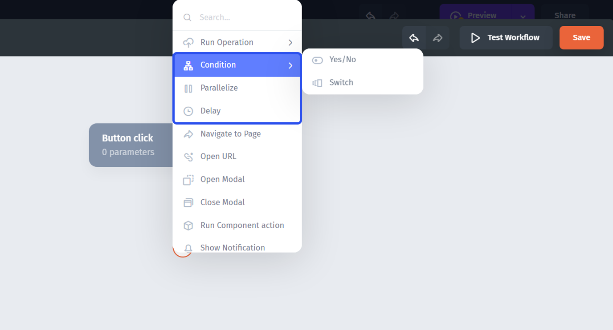
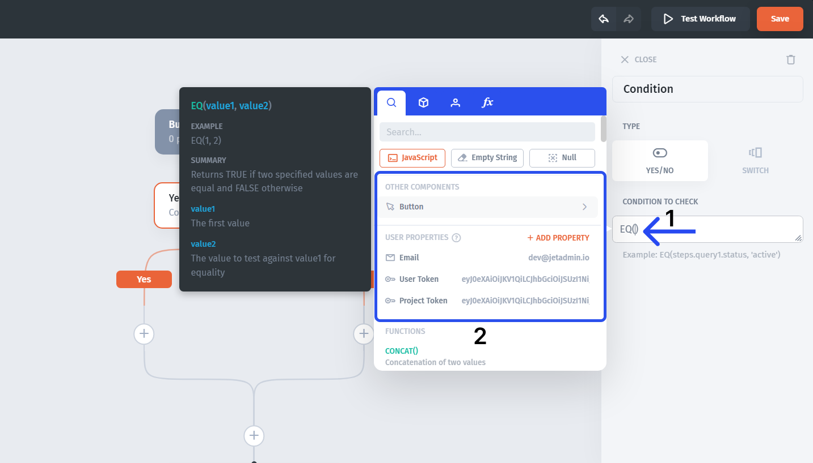
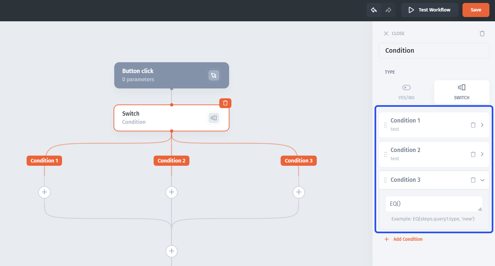

# Add conditions and branches

Use a condition when later steps should depend on an input or a step result.

## Add a Yes/No condition

1. Add a rule step and choose the Yes/No condition.
2. Open the condition's formula.
3. Compare a workflow parameter or step value with the expected value.
4. Add the actions for the Yes and No branches.
5. Test one input for each branch.

For a ticket-priority check, choose the priority value through the picker and compare it with the source's exact priority text. The formula editor supports equality comparisons such as **EQ()**. Quote literal text values.

A blank value is a separate test case. Decide whether it should follow a fallback route or stop before a write action.

## Add a Switch condition

Use Switch when the process needs several condition-based routes. Configure each route's condition and an **ELSE** fallback for inputs that do not match.

Make the conditions mutually exclusive when you intend one route per input. Test each route and the fallback; do not rely on an unverified precedence rule for overlapping conditions.

## Verify the outcome

| Test input                       | Expected result                       |
| -------------------------------- | ------------------------------------- |
| A value matching the first route | Only the intended actions change data |
| A value matching another route   | The corresponding outcome is saved    |
| A blank or unrecognized value    | The fallback behaves as designed      |

Inspect both the executed steps and the final record. For independent simultaneous work or a pause, see [parallel branches and delays](run-parallel-branches-and-add-delays.md).
