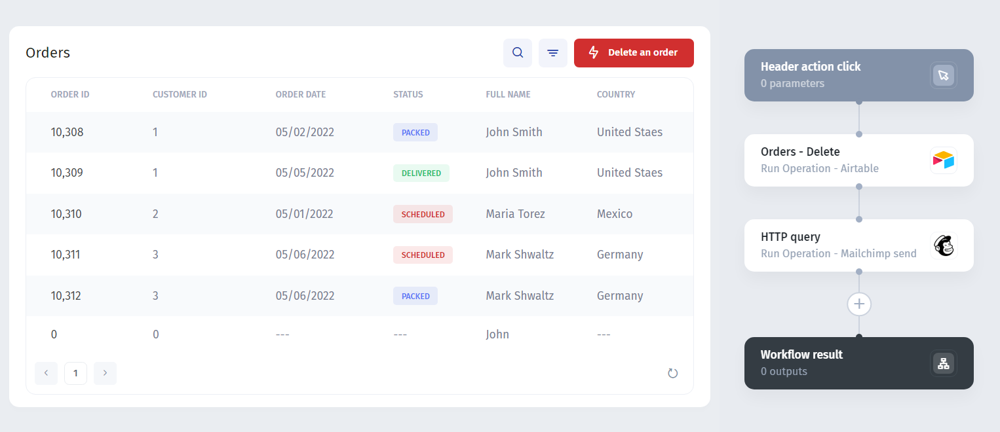
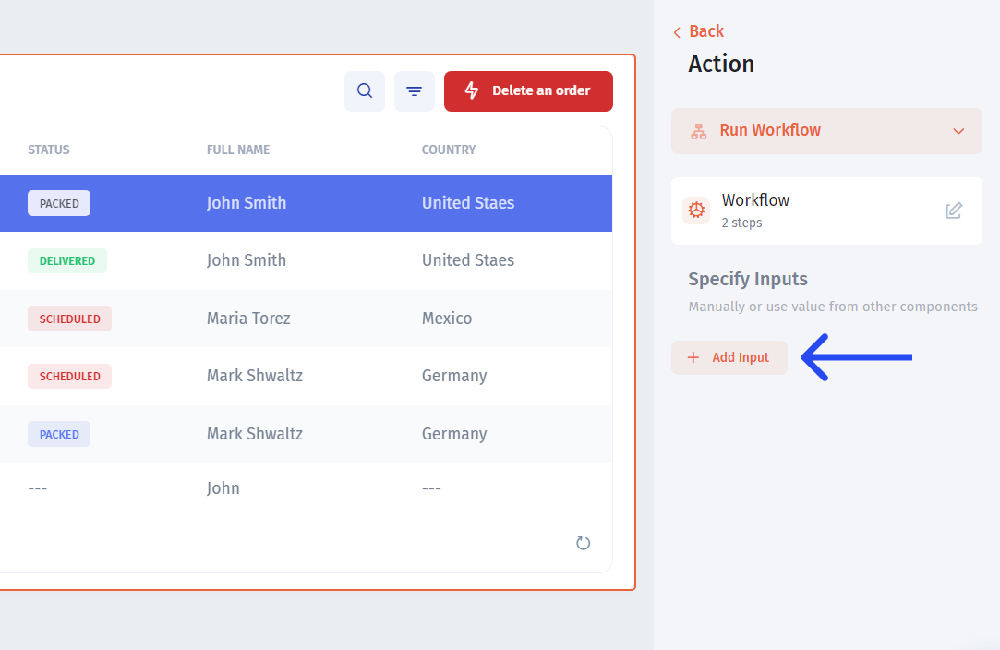
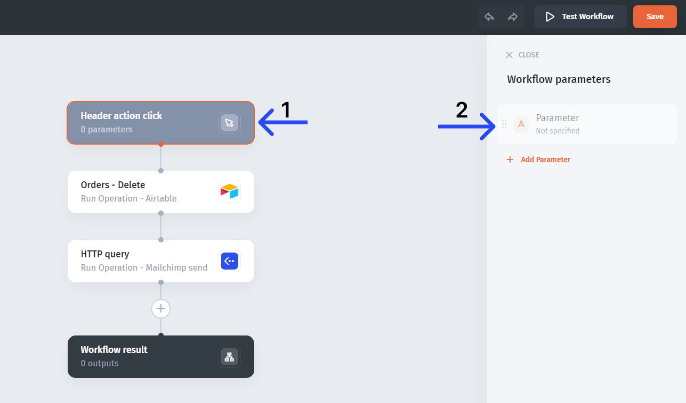
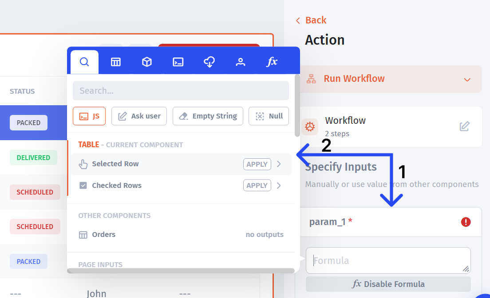
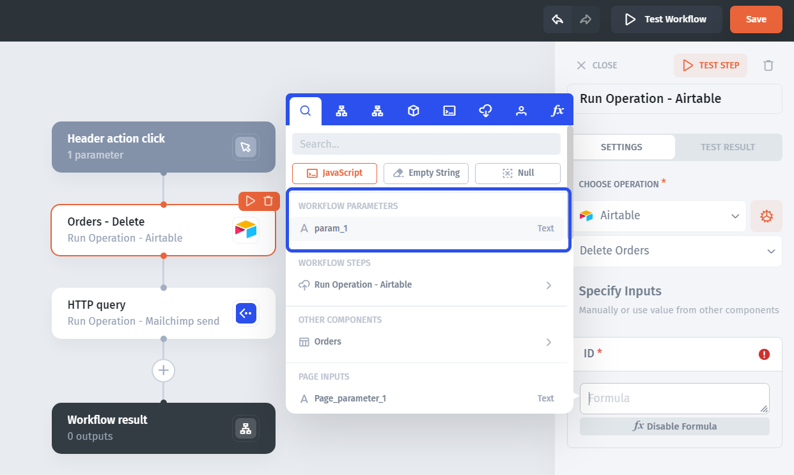
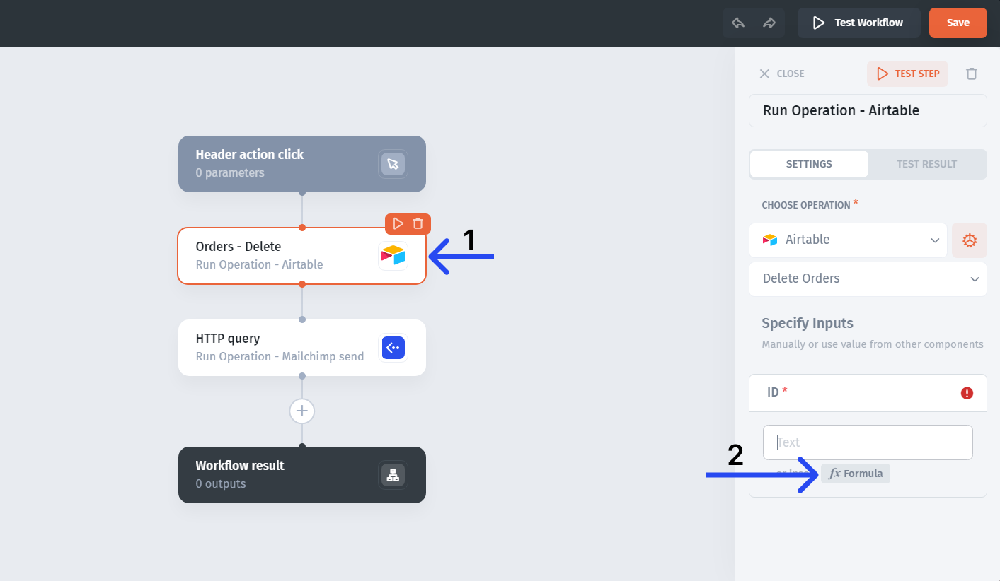
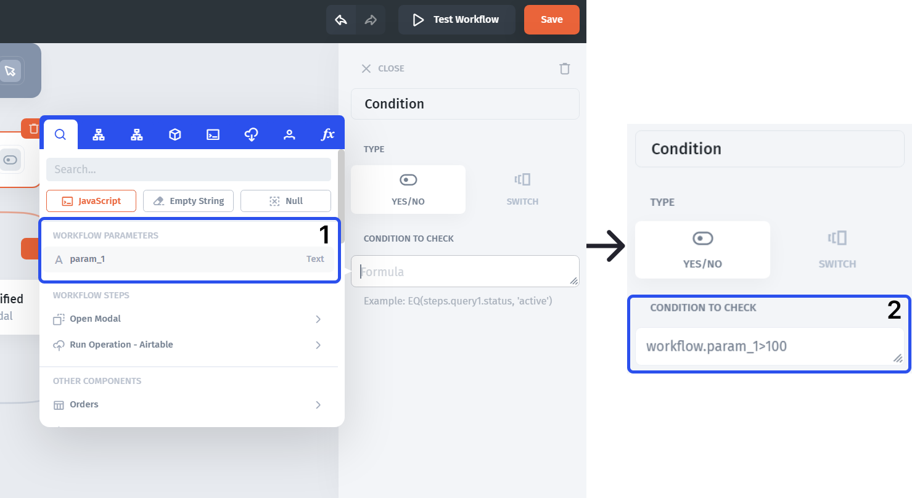

# Pass inputs into a workflow

Workflow parameters hold values supplied by the trigger. Use them to pass a selected record ID, form value, or array into later steps.

## Understand the data flow

A typical component workflow passes a value along this path:

**Selected ticket → button input binding → workflow parameter → action field**

The older example below uses a record deletion and email action to illustrate two required values: a record ID and an email address. For a first test, use the non-destructive status update in [Build your first workflow](../build-your-first-workflow.md).

## Define a parameter

1. Open the workflow and select its trigger step.
2. Add a parameter such as `ticket_id`.
3. Choose the type matching the source field.
4. Enter a known fictional record's ID as a test value.

You can access parameters from the trigger action configuration or the workflow's trigger step:

A test value helps you configure a step. It does not replace the runtime value binding in the component action.

## Bind the app value

1. Return to the button or list action that runs the workflow.
2. Select the input corresponding to `ticket_id`.
3. Use the value picker to reference the selected row's ID.

## Use the parameter in a step

Select the action field, open **Formula**, and reference the workflow parameter.

The field also supports values exposed directly in the step's context:

Use explicit workflow parameters when you want the required input to be clear. A background automation cannot rely on the selected row of an open component.

## Use an input in a condition

Parameters can also supply rule conditions. The following existing example compares a transaction amount; for Tickets, compare a priority or status value that exists in your source.

## Check the result

Run the workflow with two different IDs and inspect the input received by the action. Test missing inputs separately and prevent an update when a required identifier is absent.

If the wrong record changes, inspect both the button binding and the action's ID field. If the operation rejects the value, compare the parameter type with the source ID type.

Next: [Use step outputs and return results](use-step-outputs-and-return-results.md).
