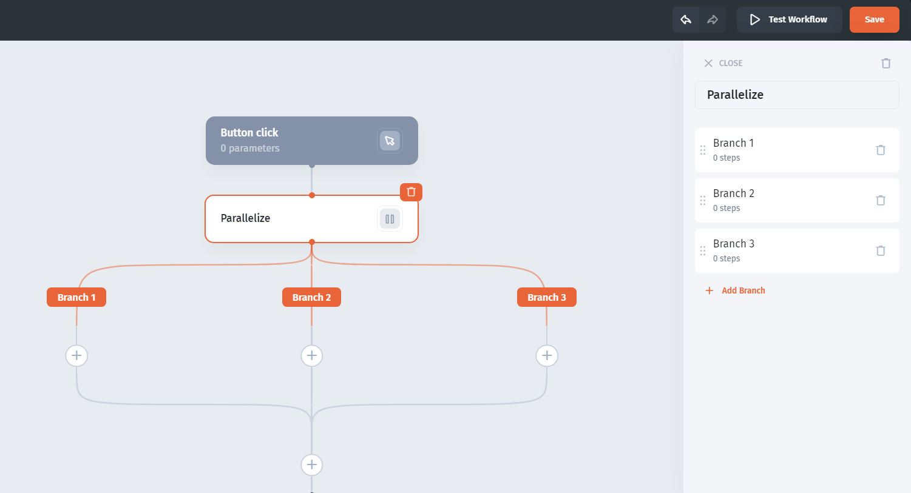
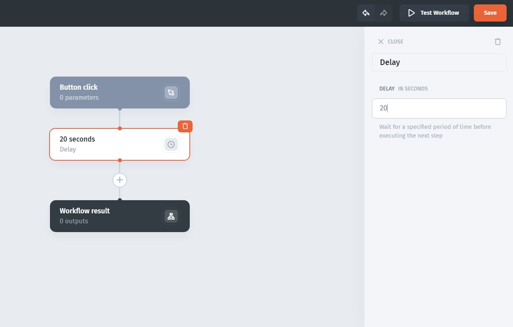

# Run parallel branches and add delays

Use parallel branches for independent work and a delay to pause before a later step.

## Run independent branches

Add the **Parallelize** rule and configure the branches that should run simultaneously.

Keep dependent actions in an ordered sequence. For example, an action that needs a newly created record's ID must follow the create action rather than run beside it.

Test each branch with the same input. Avoid parallel updates to the same fields unless your data source and process explicitly handle conflicting writes. Do not infer completion order from the branches' visual positions.

## Add a delay

Add **Delay** between steps and set the duration in seconds.

Use a delay when a fixed pause is part of the process. A pause does not prove that an external operation has completed, and it is not a retry policy. If a later action requires an external result, check that result before writing dependent data.

## Check the behavior

Test with a short interval and fictional records. Inspect each action's result, then confirm the resulting data. If a later step starts without the value it needs, replace the timing assumption with an explicit dependency.

See [Handle failures and prevent duplicate processing](../handle-outcomes/handle-failures-and-prevent-duplicate-processing.md).
