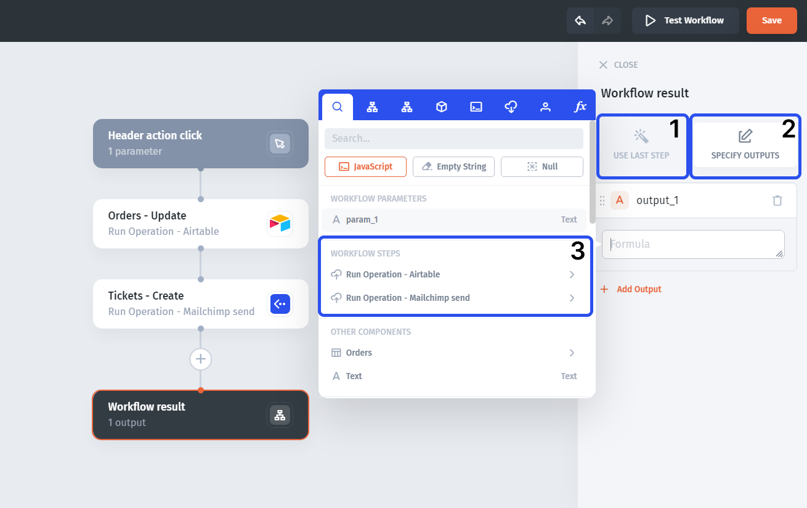
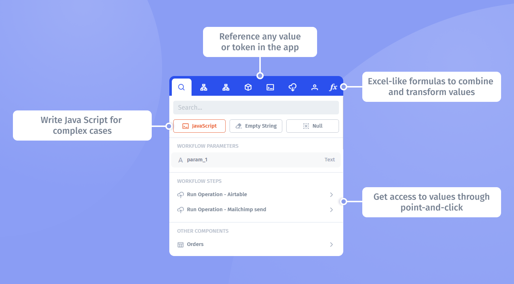

# Use step outputs and return results

A step output is the result of an action. Later steps can use it, and a component workflow can expose results back to the app.

## Inspect an output before binding it

1. Configure a step with a representative test input.
2. Test the step.
3. Inspect its result: is it a single record, a list, a scalar value, or an error?
4. Open the next action's value picker and select the field it needs.

For example, read a ticket, then pass its record ID into an update action. Do not bind an entire response object to a field expecting one ID.

## Configure the workflow result

The workflow output configuration can use the last step's output or selected outputs from specific steps.

1. Open the workflow's output configuration.
2. Use the last step's result when it is the value the caller needs.
3. Otherwise, choose the specific step output.
4. Bind the resulting value in the app where the workflow result is available.

Use the functions modal if the result needs to be combined or transformed.

## Test every result shape

Check a normal record, an empty lookup, and a failed operation. Do not let a missing result become an unfiltered update. If a branch does not execute, do not assume its step produced an output.

If the result appears in the test panel but not in the app, check both the workflow output selection and the app binding. See [testing](../test-and-troubleshoot/test-steps-and-complete-workflows.md) and [conditions](add-conditions-and-branches.md).
