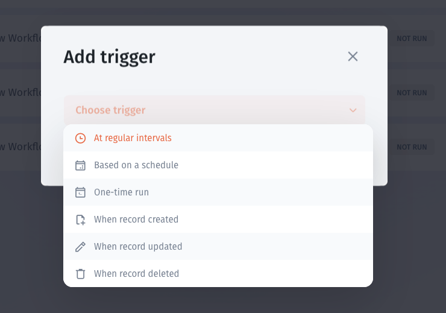
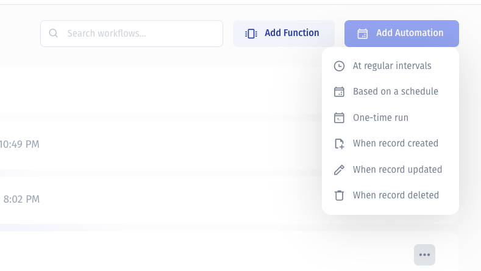

# Functions and automations

Use the **Workflows** area to build the logic your app needs. Create a function with the visual Workflow Builder or write it in TypeScript, then attach triggers when it should run automatically.

## Functions and automations: what's the difference?

| Concept        | What it defines                                            | Example                                                  |
| -------------- | ---------------------------------------------------------- | -------------------------------------------------------- |
| **Function**   | The steps or code to execute, including inputs and results | Process a list and create a task for each item           |
| **Automation** | When that logic should run, through an attached trigger    | Start processing on a schedule or when a webhook arrives |

Start by building and testing the function. Configure its trigger separately when you want an automation. Component workflows started through an app's **Run Workflow** action are another entry point; their setup is covered in [Run from a button or list action](start-a-workflow/run-from-a-button-or-list-action.md).

## Create a function

Open **Add Function** and select an authoring method.

| Option                         | Use it when                                                                           |
| ------------------------------ | ------------------------------------------------------------------------------------- |
| **Workflow Builder** — no-code | You want to arrange nodes on a canvas and see the sequence and branches visually.     |
| **Write Code** — TypeScript    | You want to express the logic in code and import JavaScript dependencies when needed. |

<figure><figcaption>
Choose how to build the function. Attach triggers later to turn it into an automation.
</figcaption></figure>

## Navigate the visual Workflow Builder

The visual editor shows the flow from **Workflow start** to **Workflow result**.

<figure><figcaption>
The example places a Create Task query inside an iterator. The start node shows zero parameters and the result node shows zero outputs; this is an editor view, not evidence of a successful run.
</figcaption></figure>

| Area                              | Purpose                                      |
| --------------------------------- | -------------------------------------------- |
| Function name and pencil icon     | Identify and rename the function             |
| **Workflow start**                | Inspect the function's input parameters      |
| Action and rule nodes             | Define the work and control flow             |
| **+** controls                    | Add steps at a position in the flow          |
| **Iterator** and **Iterator end** | Identify the repeated part of the flow       |
| **Workflow result**               | Inspect the outputs returned by the function |
| Undo and redo controls            | Revise changes in the visual editor          |

### Build and check the flow

1. Open **Workflow start** and configure the parameters the function needs.
2. Add the actions and rules for the process.
3. Bind action inputs to parameters or earlier step results.
4. For repeated work, configure the iterator's collection or array and use the current item's values inside it.
5. Configure **Workflow result** when the caller needs outputs.
6. Save the function, test it with representative input, and inspect the result.

In the pictured example, the **Jet Tables query — Create Task** node sits inside the iterator. Configure its required fields before executing it. Running a create action can create real records.

See [inputs](build-workflow-steps/pass-inputs-into-a-workflow.md), [outputs](build-workflow-steps/use-step-outputs-and-return-results.md), and [iterators](build-workflow-steps/process-multiple-records-with-iterators.md) for the individual concepts.

## Navigate the TypeScript editor

Select **Write Code** to work with source files instead of visual nodes.

<figure><figcaption>
The code editor shows index.ts for an existing function. Its project-specific code illustrates the workspace layout; it is not a reusable starter example.
</figcaption></figure>

* **Workflow Files** lists the source files.
* The file tab and breadcrumb identify the file being edited, such as **index.ts**.
* The main editor contains the TypeScript implementation.
* The top toolbar provides **Run history**, **Test Function**, **Ask AI**, and **Save**.

Use the generated structure and APIs available in your editor. Define the expected inputs, return the result the caller needs, and handle empty or invalid values. Match resource and collection identifiers to your project rather than copying them from the screenshot.

## Save, test, and inspect runs

Both editors expose these controls:

| Control           | Use                                                     |
| ----------------- | ------------------------------------------------------- |
| **Save**          | Save the current function configuration or code         |
| **Test Function** | Start a test of the function                            |
| **Run history**   | Open the function's run history to inspect executions   |
| **Ask AI**        | Open AI assistance for building or editing the function |

Use this sequence:

1. Save your changes.
2. Select **Test Function** and provide the input requested by the test interface.
3. Inspect the response and any resulting record changes.
4. Open **Run history** to review the execution details available for that run.
5. Correct any problems, save, and test again.

Check a normal input, an empty input or lookup, and a failure case. A successful test of the function does not establish that an automation's trigger is configured correctly.

## Add a trigger to a function

To run an existing function automatically, open its **Add trigger** dialog and expand **Choose trigger**. Select the event or timing option that should start the function.

<figure><figcaption>
Attach a trigger to an existing function to define when it runs.
</figcaption></figure>

## Create an automation from a trigger

In the **Workflows** area, click **Add Automation** and select a trigger from the menu. This starts automation setup with the event or timing option already chosen.

<figure><figcaption>
Start with Add Function to build the logic first, or Add Automation to choose a trigger first.
</figcaption></figure>

## Choose the trigger type

Both menus show the same six options:

| Trigger                  | When to use it                              | Example                                    |
| ------------------------ | ------------------------------------------- | ------------------------------------------ |
| **At regular intervals** | Repeat work at an interval                  | Check for pending tasks periodically       |
| **Based on a schedule**  | Run work according to a configured schedule | Prepare a daily summary                    |
| **One-time run**         | Arrange a single execution                  | Run a one-off maintenance task             |
| **When record created**  | Respond to a new record                     | Process a newly created task               |
| **When record updated**  | Respond to a record update                  | Reevaluate a task after its details change |
| **When record deleted**  | Respond to a record deletion                | Perform related cleanup                    |

After selecting a type, complete the configuration shown for that trigger. For timed runs, check the timing and effective time zone. For record events, select the relevant source and collection where prompted and inspect the event values available to the function.

The menus show the trigger choices, not the completed configuration or a successful run. Do not assume a deleted record can still be fetched from its source; inspect the event data before making later steps depend on it.

## Verify the automation

1. Save the function logic and complete the trigger configuration.
2. Test the function with representative input.
3. Exercise the actual trigger using a test record or controlled time setting.
4. Inspect **Run history** and the resulting data.

For an update-triggered automation that writes to the same collection, check whether its own write can trigger more work. Add conditions or processed markers as needed, and test repeated events.

See [Run on a schedule](start-a-workflow/run-on-a-schedule.md) and [Handle failures and prevent duplicate processing](handle-outcomes/handle-failures-and-prevent-duplicate-processing.md).

The six choices above are the options visible in these menus. For the separately documented HTTP-event setup, see [Receive an incoming webhook](start-a-workflow/receive-an-incoming-webhook.md).

Workflow functions are different from formula functions used in computed fields. For those, see [List of Functions](../user-guide/data/computed-fields/formulas/list-of-functions.md).

## Record-event scope

In record-trigger setup, choose the resource and collection. The inspected Jet Tables collection selector explicitly says **collections (changes from Jet only)**. Do not assume that a direct write to an external database will start this automation.

Test creation, updates, and deletion separately using a disposable record changed through Jet. Inspect the event values before mapping them; the available fields and delivery behavior must be verified for your configured trigger.
