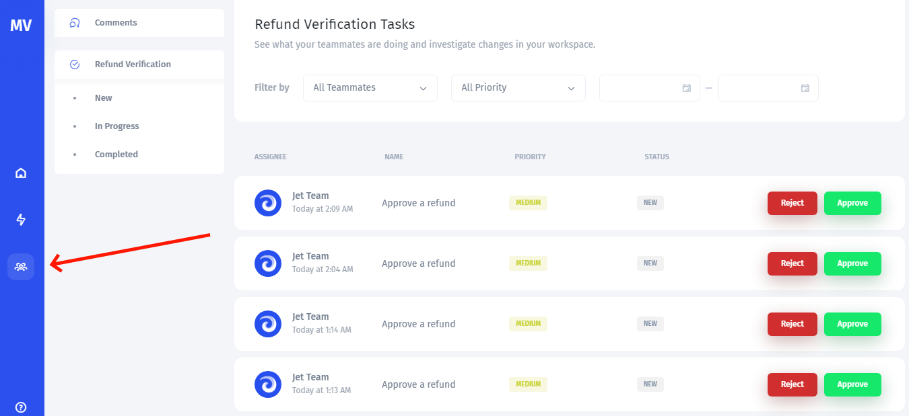
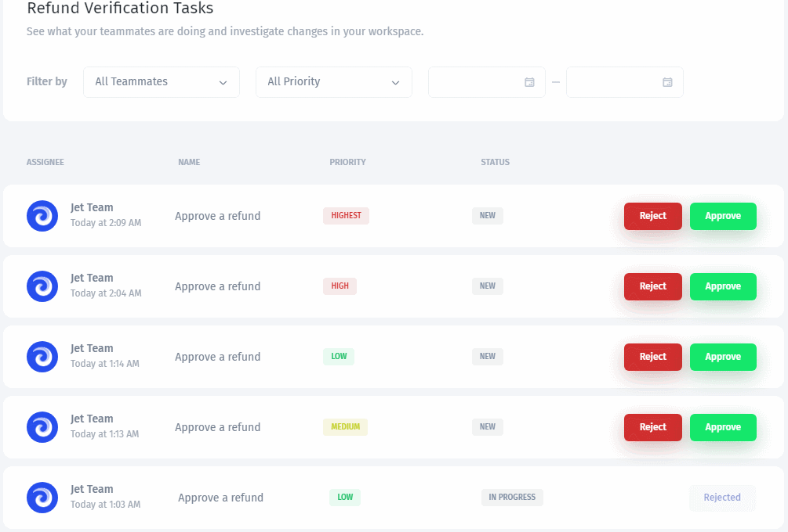
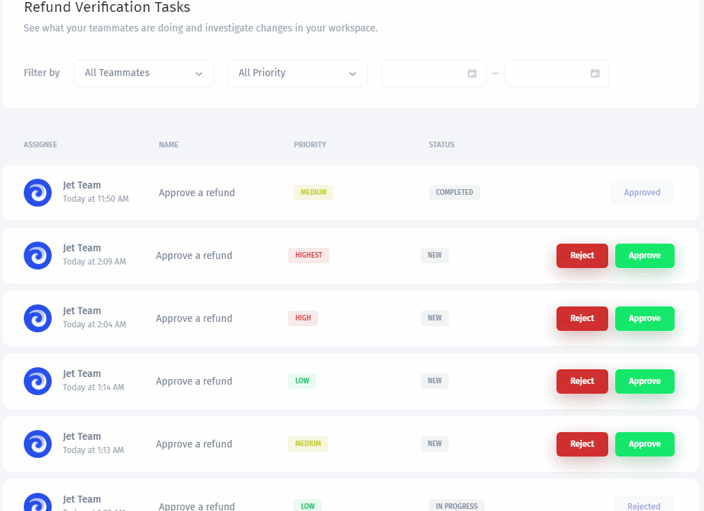
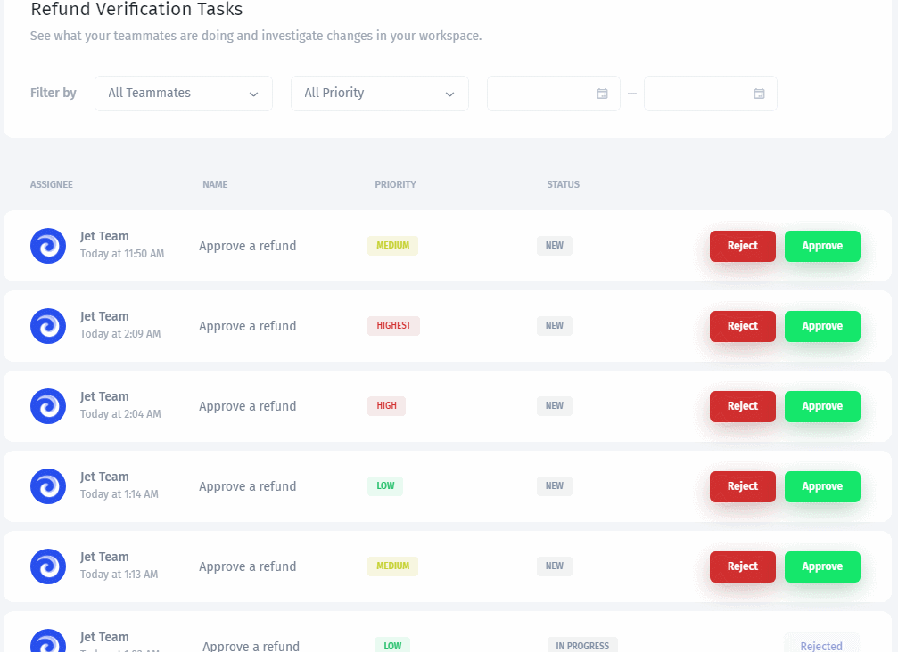

# Create an approval process

Require a person to approve an action before it executes. This guide covers the button approval and task queue controls shown in the existing builder walkthroughs.

The walkthrough uses a refund request. Use fictional data and a test action when learning the process.



## Before you start

Define the action requiring approval, the person who should review it, and the details they need. Confirm that the intended requester and approver can access the relevant app and queue. A queue assignee and the underlying data-source permissions are separate concerns.

## Enable approval on the button

1. Select the button.
2. Open its **Actions** tab.
3. Enable approval for the button's action.



## Create a task queue

1. Choose **Select a Queue**, then **Add New**.
2. Name the queue.
3. Define statuses for the stages and outcomes.
4. Save the queue.



Configure parameters that will help the approver understand the request, such as ticket ID, transaction ID, amount, and reason.

.png>)

## Configure the approval task

Select the queue, then configure:

* **Task Name:** a fixed name or a formula containing request details.
* **Initial status:** the state before the decision.
* **Initial assignee:** the person who should review the request.
* **Status after approval:** the queue state after approval.
* **Status after reject:** the queue state after rejection.

Choose status labels that match your process. A status label describes the task; it does not replace the approval decision.



Map the task parameters to values from the app.

.png>)

## Review and decide

Run the button action with fictional data to create a request. Open the collaboration/task queue interface as the intended approver.

Use the queue filters to find the request by assignee, date, or priority.

Open it and inspect the details passed from the app.

Approve to execute the configured action and update the task status, or reject to update the task status without executing that action.

## Test both outcomes

Create separate test requests for approval and rejection. Confirm that approval executes the intended action once and rejection leaves the target data unchanged.

Also test with the intended requester and approver accounts. If a request exists but the action fails after approval, inspect the operation's permissions and input rather than treating the queue status alone as proof of success.

See [testing](../test-and-troubleshoot/test-steps-and-complete-workflows.md) and [failure handling](../handle-outcomes/handle-failures-and-prevent-duplicate-processing.md).
