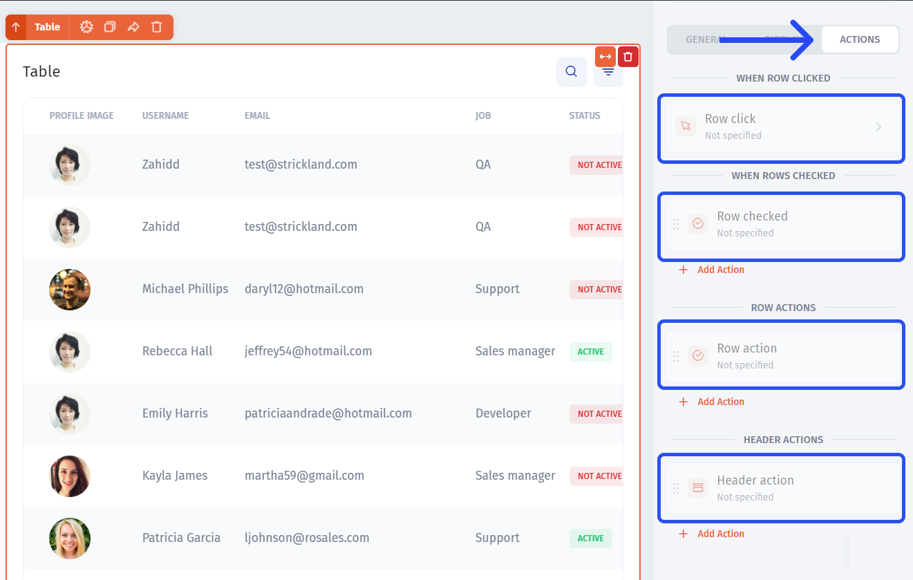

# Run from a button or list action

Use a component workflow when an app user starts the process. This guide applies to the builder's component **Actions** configuration.

## Run from a button

1. Select the button.
2. Open **Click action** in its Actions configuration.
3. Choose **Run Workflow** and configure the workflow.
4. Define the workflow's parameters and bind each input to the appropriate component value.
5. Test from the app with a known selected record.



## Run from a list action

Open the list component's action configuration and choose the relevant action. Lists include Table, Map, Kanban, Gallery, Timeline, and Calendar. Choose **Run Workflow** where the action offers it, then bind the values supplied by that action.

A row action and an action processing several selected records require different inputs. Inspect the available value and its type instead of assuming that a table's visible records equal its selected records. For bulk work, use [Process selected records](../practical-guides/process-selected-records.md).

## Run after another component action

Use a success or error callback when another action should start the workflow.



Select **Run Workflow** for the callback and specify the workflow.



See [component success and failure actions](../handle-outcomes/component-success-and-failure-actions.md) for execution-order considerations.

## Verify the binding

Test with two different fictional tickets. The input ID should change when the selected ticket changes. If the editor test works but the button does not, check the runtime binding and the selected row. See [inputs](../build-workflow-steps/pass-inputs-into-a-workflow.md) and [testing](../test-and-troubleshoot/test-steps-and-complete-workflows.md).
