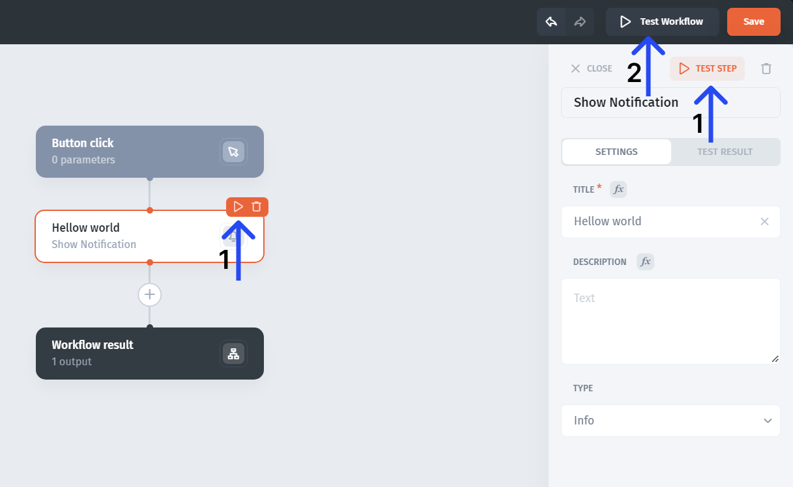
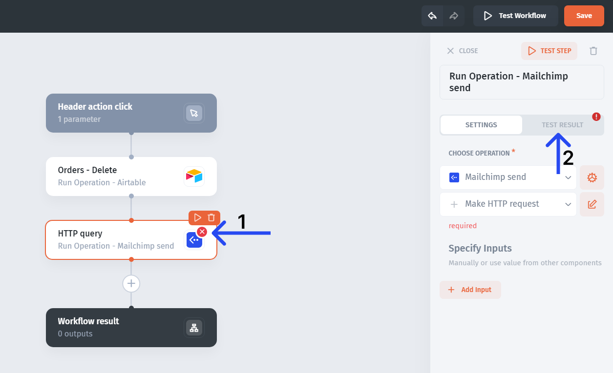

# Test steps and complete workflows

Test individual steps to diagnose their inputs and outputs, then test the complete workflow and its real trigger.

## Prepare test inputs

Choose a fictional record and record its original state. For a `ticket_id` workflow, prepare a valid ID, a missing ID, and a record that should take another branch.

Set test parameters on the trigger step. Match their types to the values the real caller will supply.

## Test a step or the whole workflow

The editor provides controls for testing individual steps and the complete workflow.

1. Run the first step with your test input.
2. Inspect its output.
3. Configure and test the dependent step.
4. Run the complete workflow.
5. Inspect the resulting record or external action.

Testing can execute writes and notifications. Use test records and destinations you control; do not assume the test control simulates effects.

## Inspect an error

A failing step is highlighted. Select it and open the **test** tab to read the error.

Check the received value, expected type, record identifier, and operation access. Inspect earlier effects before repeating a run.

## Test the actual trigger

A successful editor test does not prove that a button binds the right input, a schedule is enabled, or a webhook sender uses the expected payload.

Run the actual entry point with fictional data. Compare the input and final outcome with the editor test.

## Minimum test matrix

| Case                     | What to verify                                            |
| ------------------------ | --------------------------------------------------------- |
| Normal input             | The intended record changes                               |
| Other branch             | The alternate path produces its expected result           |
| Empty lookup or list     | No unrelated records change                               |
| Missing or invalid input | The process stops or follows the intended fallback        |
| Controlled failure       | The error is understandable and earlier effects are known |
| Repeated input           | Repeat behavior matches the design                        |

For background work, check the trigger's available execution details and the final data. Do not assume the editor test panel is a persistent run-history feature.

See [Troubleshoot common problems](troubleshoot-common-problems.md).
